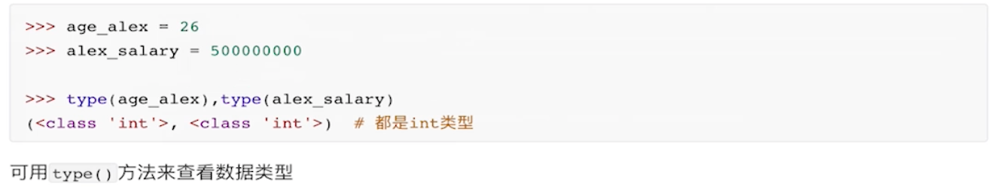
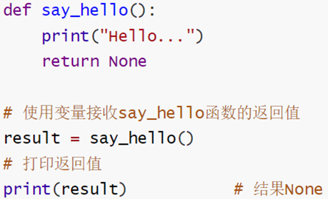
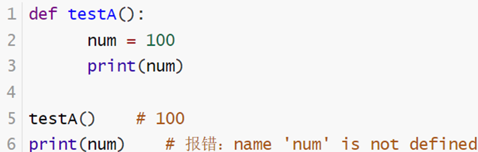

#  						一: 字面量

## 1.1 含义

- 在代码中，被写下来的固定的值，称为字面量

## 1.2 常用的值（数据类型）

- | 类型                        | 描述                                                         | 说明                                                         |
  | --------------------------- | ------------------------------------------------------------ | ------------------------------------------------------------ |
  | 数字(number)-- 数字不加引号 | - 整数(integer--int)<br />-浮点数(float)<br />-复数(complex)<br />-布尔(bool) | - 整数：10, -10<br />-浮点数: 12.14, -12.14 <br />-复数: 4+3j 以j结尾表示复数<br />-布尔: 表达现实生活中的逻辑，即真(True)和假(False); True 本质上是一个数字记作1，False记作0 |
  | 字符串(String--str)         | 描述本文的一种数据类型                                       | - String 由任意数量的字符组成如：中文，英文，各类符号，数字组成<br /> |
  | 列表(List)                  | 一系列按特定顺序排列的元素组成                               | 可有序记录一堆数据，用方括号（[ ]），并用逗号来分隔其中的元素，每一个元素要用引号包围 |
  | 元组(Tuple)                 | 有序的不可变序列                                             | 可以有序记录一堆不可变的Python数据集合                       |
  | 集合(Set)                   | 无序不重复的集合                                             | 可以无序记录一堆不重复的Python数据集合                       |
  | 字典(Dictionary)            | 无序Key- value 集合                                          | 可以无序记录一堆Key-Value型的Python数据集合                  |

- **除了str在print()中需要加引号，其他的都不需要**


# 							二: 注释


- 含义：在程序代码中提前对要执行的程序代码进行解释说明的文字
- 作用：注释不是程序，**不会被执行**，只是对程序代码进行解释说明，让别人能看懂程序代码的作用，增加可读性 

## 2.1 注释的分类

- 单行注释： 以 # 开头，后面所有的文字当作说明，而不是真正要执行的程序，起<u>**辅助说明作用**</u> （#号和注释内容一般以空格隔开）

``` Python
# 我是单行注释
print("Hello World")
```


- 多行注释：以 一对三个双引号 (” “ ”注释内容" “ ”)来解释一段代码的作用 --（一般写在文件的最上方/开头）

  ```python
  """
  		注释一
  		注释二
  		注释三
  """
  
  代码块
  ```
  
  
  
  


# 					三: 变量(变量名=变量值)

## 3.1 含义

- 标识符：用户在编程时所使用的一系列名字，用于给变量，类，方法等命名

- 变量：能储存计算结果/表示某一内容的抽象概念，记录数据用的

- 变量没有类型，但是变量储存的数据是有类型的

- > 计算机的最核心功能是计算，CPU是负责计算的，计算所需要的数据源，数据源要存在内存里

## 3.2 具备的条件

- 变量名

  - ``` 
    message(变量名) = "Hello Python world!"（变量值：所储存的内容）
    print(message)

- 变量值 （如果变量值是数字就不需要加双引号，如果是一串名称需要加双引号）

- 内存地址

## 3.3 使用的规则

1. 内容限定，只允许出现：

   - 英文 :star2:（字母）

   - 数字**(不可以用在开头)**：` 2name = kelly(这里的变量名是以数字2开头的，会报错)` 

   - 下划线_（位置没有限制）： _a_b ; a_d ; _a
     - 变量名中不能包含空格
     - 可使用下划线来分隔其中的单词(greating_message = ....)
     - 一定要先定义变量名后使用变量值，否则会报错

2. 大小写敏感,是可以完全被区分的：

```python
>>>Audi = "奥迪1"
>>>audi = "奥迪2"
>>>print(Audi)
奥迪1
>>>print(audi)
奥迪2
```

3. 不可以使用关键词作为变量名

> False		True		None		and		as		assert		async		await		break		class		continue
>
> def		    del		  elif		    else		for	   finally		except	   from		global		import	lambda
>
> if			    in		    not		   pass 	  or         is 			   raise		  return	  try			  while	   with
>
> yield         nonlocal

4. 先定义再调用：` height = 180        print(age)=... `这里的age没有提前定义它的值，最后会无法运行

5. 在程序全局都会用到的变量，尽量定义在文件开头

## 3.4 变量的命名规范

1. 见名知意

   - 简洁：在确保“明了”的前提下，减少名字的长度（变量名不要过长）

   ``` python
   a_person_name = "Tina"				==>				name = "Tina"
   ```

   - 明了：看到名字就知道是什么意思

     ```python
     # 不明了														# 明了
     a = "上海"													place = "上海"
     ```

2. 下划线命名法

   - 多个单词组合变量名，中间使用下划线做分割

   ``` python
   firstnumber = 1				==> 	first_number = 1 ; age_of_oldboy = 56
   
   ```

3. 英文字母全小写

   - 变量名的中的英文都用小写字母
   - 单词首字母不要大写，因为大写是用来定义类名
   - 不要用中文拼音做变量名

##  3.5 变量的修改

如果想要重新定义变量名的值，不用重新再创一个新的变量名，直接改变量名的值就行见图：


## 3.6 如何删除变量

用del+想要删除的变量名，

```python
name = "TINA"
del name
```


##  3.7 如何让变量值的字母大写/小写

（只有首字母大写）： 

（全部字母大写）&（全部小写）：

# 						四: 数据类型

## 什么是数据类型

			- 整数；浮点；字符串；布尔；列表；元组；字典；集合

## 如何检查数据类型

- 用type(被查看的类型)    如图: 

  

- 我们通过type()可以检查括号内数据的类型，因为变量存储的是数据，变量无类型，但是它所储存的数据是有类型的


# 1⃣️数字类型

## 	4.1.1 **int（整数型）**



## 	4.1.2 Float(浮点型)：

​	小数

### :red_circle: 注意:

1. 小数类型的字符串不能直接转换成整数
2. 小数类型的字符串只能先转换成**浮点数**，在转换成**整数**

```python
>>> milk_tea = "奶茶"
>>> number = 15
>>> price = "168.75"
>>> unit_1 = "元"
>>> unit_2 = "杯"
>>>print(str(number)+unit_2+milk_tea+"共"+str(int(float(price)))+unit_1)

15杯奶茶一共168元
```


# 	2⃣️字符串-str

- 有序的字符集合

## 4.2.1 字符串在python中的三种定义方式

- 用单引号/双引号/三引号来表示
  1. 单引号: name = 'Tina'
  2. 双引号name = "Tina"
  3. 三引号name = """Tina"""
- 如果定义的字符串本身里包含：单引号/双引号，该如何写呢
  1. **单引号定义法**： 可以内含双引号区分开
  2. **双引号定义法**： 可以内含单引号区分开
  3. 可以用**转移字符**( \ )来将引号解除效用，变成普通的字符串


- **多引号的区别： 可以换行继续写**


## 	4.2.2 数字类型与字符串转换

- 想要	字符串转换数字类型内容**只能是数字**

- | str(x)   | 将x转换成字符串   |
  | :------- | ----------------- |
  | int(x)   | 将x转换成一个整数 |
  | float(x) | 将x转换成浮点数   |

  Ex:

``` Python
# 将数字类型转换成字符串    str(x)-将x转换成字符串
>>> num_str = str(11)
>>> print(type(num_str),num_str)
<class 'str'> 11

# 将字符串转换成整数类型    int(x)-将x转换成一个整数
>>> num = int("11")
>>> print(type(num),num)
<class 'int'> 11

#将字符串转换成浮点型      float(x)-将x转换成浮点数
>>> num2 = float("11.345")
>>> print(type(num2),num2)
<class 'float'> 11.345

# 将整数转浮点数
>>>float_num = float("11")
>>>print(type(float_num),float_num)
<class 'float'> 11.0

# 将浮点数转整数
int_num = int(12.345)
print(type(int_num),int_num)
<class 'int'> 12
```

## 4.2.3字符串拼接

- <u>一般用于字面量与变量； 变量与变量之间</u> 

- 字符串可以进行“相加”/“相乘”的运算，减和除不可以，**因为需要双方都需要是字符串，**不能跟数字/其他类型拼接

``` Python
>>> name = "Tina"
>>> home = "shanghai"
>>> age = 19
>>> name + home   # 相加就是两个字符串拼接
'Tinashanghai'

>>> name + age   		#相减就不行，因为age的值不是字符串
TypeError:must be str. not int.

>>> name * 3  # 相乘就是复制多少次
'TinaTinaTIna'

>>> name = "Tina"
>>> address = "shanghai"
>>> print("我叫" + name + "，我在" + address +"上学。" )      
我叫Tina，我在shanghai上学。
```

## 4.2.4字符串格式化 

- ```python
  (要输出的内容 % 要格式化的变量或数值)
  ```

#### 1. %d/%s/%f

- 字符串，整数，浮点数三种不同类型变量的占位 

| 符号 | 转化<br />%: 我要占位                                        |
| ---- | ------------------------------------------------------------ |
| %s   | s : 将变量变成字符串放入占位的地方<br /> == 我先占个位置，等会有个变量过来，我把它变成字符串放到占位的位置 |
| %d   | 将内容转换成整数，放入占位位置                               |
| %f   | 将内容转换成浮点行，放入占位位置                             |

```python
# 通过占位的方式，完成变量转字符串的拼接
1.
>>> name = "Tina"
>>> print("My name is %s" % name)  #如果只有一个，不用在外面甜括号补充了
My name is Tina
2.
>>> name = "Tina"
>>> age = 19
>>> message = "My name is %s and I am %s years old." % (name,age) # 按顺序填写
>>> print(message)   
My name is Tina and I am 19 years old.

# 通过占位的方式，完成数字和字符串的拼接
>>> food = "ice-cream"      
>>> site = "KFC"      
>>> money = 10      
>>> drinks = "cola"      
>>> money2 = 15.5
>>> message = "I went to %s and bought a %s and %s, which cost me %d and %f yuan respectively." % (site,food,drinks,money,money2)
>>> print(message)      
I went to KFC and bought a ice-cream and cola, which cost me 10 and 15.500000 yuan respectively.   #这里的15.5转换成了15.500000是因为没有对它做精度控制
```

#### 2. f"内容{变量}" 

- :exclamation: f不要忘了
- 特点
  - 不理会类型
  - 不做精度控制

```python
>>> name = "xx公司"  
>>> money = 100000      
>>> print(f"{name}的老板买了一栋价值{money}的房子")      
xx公司的老板买了一栋价值100000的房子
```

#### 3.表达式格式化

- **f"(表达式)" 或 "%s%d%f"%(表达式)**
- 表达式：一条具有**明确执行结果**的**代码语句**。 他们有具体的结果，右侧都是表达式，赋值都给了等号左边的变量
- 例如：name = "张三"  ;  age = 1+5（等号右边都是表达式）
- 可以不用再定义变量去存储变量值/存储数据，直接在括号内写 


## 4.2.5 字符串索引

- 取值方法： 前加1，后不变
  - [0:5] 取第1个，到第5个

- 取值语法

  - 字符串变量名/字符串本身
  - 英文中括号
  - 索引值

  ```python
  id_card = "78437437483"
  print(id_card[3])
  3
  
  a = "Hello"
  print(a[0])
  H
  ```

  

- 正索引：从左往右开始编号，从0开始

- 负索引：从右往左，从-1开始

## 4.2.6 序列：切片

#### 序列概念：

- 是指内容连续，有序，可以使用下标索引的一类数据容器
- <u>列表，元组，字符串均可视为序列</u>

#### 切片语法

- 字符串[start: end: step]
- 字符串[开始的字符索引：结束字符：步长]
- 顾头不顾尾
- 步长可以为负数，表示倒序从左向右执行

```python
id_card = "832803828938"
print(id_card[0:2])
83
print(id_card[:4])
8328
print(id_card[2:10:2])
2088
```

##### [:] 从头到尾切片

```python
num =[1,3,5,7,8,4]
num[:]
[1, 3, 5, 7, 8, 4]
```


##### [::-1]字符串倒序取值

```python
str = "万国薪月，员序程马黑来，nohtyp学"
str[::-1][9:14]
            
'黑马程序员'

#步长为 -2
num =[1,3,5,7,8,4,32,54,74,10,20]
num[::-2]
[20, 74, 32, 8, 5, 1]
```

````python
name = "万国薪月,员序程马黑来,nohtyp学"
name.split(",")[1].replace("来","")[::-1] #split先分割成list，再用replace把来替换掉，最后用[::-1]把字符串倒序
'黑马程序员'
````


## 	4.2.7 字符串格式化-数字精度控制

上面的三种种格式化都不能数字精度控制，如%格式化的最后一个案例：数字最后输出的结果是没有经过精度控制

- "m.n" 控制数据的宽度和 精度
  - m 控制宽度(很少用)设置的宽度小于数字自身，不生效
  - .n 控制小数点精度，会进行小数的四舍五入
- Ex:（**<u>⚠️：d和f的使用）</u>**
  - %5d: 表示将**整数**的宽度控制在五位数，如果数字15，被设置为5d,结果为\[空格]\[空格]\[空格]15(前面会用三个空格补充宽度)
  - % 5.2 表示将宽度设置在5，小数点精度设置为2
    - **小数点**和小数部分也会被算入宽度计算内
    - Ex: 11.345 设置了%7.2f后，结果为：\[空格]\[空格]11.35（两个空格补足了宽度，小数部分限制两位精度后，四舍五入为.35）
  - %.2f 表示不限制宽度，只设置小数点精度为2 （11.345 > 结果为 11.35）
- 保留4位小数print("{:.4f}".format(3.17827))
  - 英文冒号
  - 一个英文小圆点
  - 输入一个整数，表示小数点保留的位数
  - f
  - format
  - 浮点数本身/变量名

## 4.2.8 总结格式化字符串

【1.字符串拼接法】

```python
name = "安迪"
city = "云南"
school = "复旦大学"
print("大家好，我叫"+name+"，来自"+city+"，毕业于"+school+"!")
```

```
大家好，我叫安迪，来自云南，毕业于复旦大学!
```

【2.`%`占位符格式化】

```python
name = "安迪"
city = "云南"
school = "复旦大学"
print("大家好，我叫%s，来自%s，毕业于%s！" % (name, city, school))
```


```
大家好，我叫安迪，来自云南，毕业于复旦大学！
```

【3. `.format`字符串格式化】

```python
name = "安迪"
city = "云南"
school = "复旦大学"
print("大家好，我叫{}，来自{}，毕业于{}！".format(name, city, school))
```

【终端输出】

```
大家好，我叫安迪，来自云南，毕业于复旦大学！
```


【4. `f`格式化字符串】第3种字符串格式化方法。

```python
name = "安迪"
city = "云南"
school = "复旦大学"
print(f"大家好，我叫{name}，来自{city}，毕业于{school}！")
```

【终端输出】

```
大家好，我叫安迪，来自云南，毕业于复旦大学！
```

## 4.2.9 字符串常用用法

` encode(self,sub,start=None,end=None)`

` startswith(self,prefix,start=None,end=None)` 

###### strip

- 移除字符串**头和尾**指定的字符（默认是空格或换行符）或者是字符序列

```python
strip(self, chars=None)		#去除前后空格

# 字符串.strip() -- 去除前后空格
>>> str = '   Tina    '
>>> str.strip()
'Tina'
# 字符串.strip(字符串) -- 去除前后指定字符串
>>> a = 'T with h '
>>> a.strip('T')
' with h ' #T会被去除
```

###### rstrip

- 删除string字符串**末尾**的指定符号（默认为空格）

```python
str = "000this is a string example, wow!!000"
str.rstrip("0")
'000this is a string example, wow!!' #只删除了末尾的0
```


###### center

```python
center(self,width,fillchar=None) #填充
>>> place = 'shanghai'
>>> print(place.center(20,"-"))
------shanghai------
```

###### count

````python
count(self,sub,start=None,end=None) #计算重复元素 
>>> a = "shanghai songjiang minghang"
>>> print(a.count("i")) #注意括号内的字符串的双引号
3
>>> print(a.count("i",0,10)) #从索引0到10，i有几个,0=start;10=end
1
````

###### endswith/startswith

```python
endswith(self,suffix,start=None,end=None) #判断结尾：字符串最后一个元素结尾是否正确
startswith(self,prefix,start=None,end=None) #字符串第一个元素结尾是否正确
>>> a = "shanghai songjiang minghang"
>>> print(a.endswith("g"))
True
>>> print(a.endswith("u"))
False
```

###### find

```python
find(self,sub,start=None,end=None) #字符查找，返回-1代表没找到，如果找到了就会返回相应字符的索引
>>> a = "shanghai songjiang minghang"
>>> print(a.find("i"))
7
>>> print(a.find("p"))
-1
```

###### isdight

```python
isdigit(self) #判断是否是整数
>>> a = "shanghai songjiang minghang"
>>> print(a.isdigit())
False
>>> print("120".isdigit())
True
>>> print("12.09".isdigit())
False
```

###### join

```python
join(self,iterable) #拼接字符串：把列表里的值拼接成字符串
>>> name = ["Tina", 'Bella', 'Serein']
>>> print("".join(name))
'TinaBellaSerein'
>>> print(";".join(name))
'Tina;Bella;Serein'
```

###### 字符串.replace(字符串1，字符串2)

- 将字符串的全部：字符串1，替换成字符串2

```python
#字符串替换
replace(self,old,new,count=None) # old=你想替换的值；new=新值；count=换几个
>>> name = "Serein Song"
>>> name.replace("S","L",2)
'Lerein Long'
>>> name.replace("S","L",1)
'Lerein Song'
 
#将空格替换别的符号'|'
>>>	str = "ittheima itcast boxuegu"		
>>> str.replace(" ","|") 
            
'ittheima|itcast|boxuegu'
```

###### split() 

- 以空格为分隔符将字符串拆分多个部分，并将这些部分都存储到列表中

```python
split(self, sep=None, maxsplit=-1)` #把一个字符串变成列表,sep是分隔符(按什么来分隔print),默认是按空格来分;后面的数字表示按几次分
>>> name = 'Serein Song'
>>> name.split()
['Serein', 'Song']
>>> print(name.split("e"))
['S', 'r', 'in Song']
>>> print(name.split("e",1)) #e只分1次，所以第二个e没有被分割
['S', 'rein Song']
```


## 4.2.9-2字符串大小比较方式

- 字符串所使用到的字母，数字和符号都是来自**ASCII码表**，每一个字符都有一个相对应的数字码值
- 字符串的比较就是基于数字的码值大小进行比较

# :paperclips: 总结字符串

```python
str: "中国电信","上海市"
#独有功能：
upper / lower / isdecimal / strip /lstrip / rstrip /replace / join /split /center /ljust /rjust /zfill 
# 公共
len /索引 /切片 /for循环/in（是否包含）
```


# 3⃣️列表[]

- 由一系列按特定顺序排列的元素组成
- 用方括号<u>（[ ]）来表示列表，并用逗号来分隔其中的元素，每一个元素要用引号包围</u>
- print(变量名)

## 4.3.1 如何添加，删除，修改，判断列表里的元素

#### 插入-insert()

```Python
>>> names = ["Alex","Peter","Tina","Kelly"]
>>> names.insert(3,"Alan")    # 这里的数字3，代表你想插入哪一个下标的位置，一次只能插一个
>>> names
['Alex', 'Peter', 'Tina', 'Alan', 'Kelly']
>>>
```


#### 列表嵌套

```python
>>> names.insert(2,[1,2,3,])
>>>names
['Alex', 'Peter', [1, 2, 3], 'Tina', 'Kelly']
#如何取值
>>> names[2][2]
3
```


#### 追加-添加到列表的尾部-append()

```python
>>> names = ["Alex", "Peter", "Tina", "Alan", "Kelly"]
>>> names.append("Vivian") #以这为例，添加想添加的内容
>>> names
['Alex', 'Peter', 'Tina', 'Alan', 'Kelly', 'Vivian']
```

#### extend() 追加一批元素

```python
num = [1,2,3,4,5,6,7,8,9,11]
num.extend([24,56,86])
num
[1, 2, 3, 4, 5, 6, 7, 8, 9, 11, 24, 56, 86]
```


#### 列表的修改

- 列表名[索引] = 新的元素内容

```python
>>> names = ["Alex", "Peter", "Tina", "Alan", "Kelly", "Vivian"]
>>> names[0] = "Olin"    # 直接根据下标找到元素重新赋值就行
['Olin', 'Peter', 'Tina', 'Alan', 'Kelly', 'Vivian']
```

#### 合并列表

- 可以把另一个列表的值合并到一起

```python
>>> name = ['Tina', 'Bella', 'Shirley', 'Vivian']
>>> name_2 = ['Serein', 'Timmy', 'Mike']
>>> name.extend(name_2)
>>> name
['Tina', 'Bella', 'Shirley', 'Vivian', 'Serein', 'Timmy', 'Mike']
```


#### 删除元素

##### remove

- 通过元素名进行删除

``` Python
# 方法一：remove 元素值删除
>>> names = ["Olin", "Peter", "Tina", "Alan", "Kelly", "Vivian"]
>>> names.remove("Vivian")   # 通过指定元素名删除,若果元素有重复的，但是想都删掉的话，需要多次重复此操作，因为计算机只会从左边开始删，不管后面有没有重复的元素
>>> names
['Olin', 'Peter', 'Tina', 'Alan', 'Kelly']
```

##### del

```python
# 方法二：del 直接删
>>> names = ["Olin", "Peter", "Tina", "Alan", "Kelly", "Vivian"]
>>> del names[3] # 通过下标方式
>>> names
['Olin', 'Peter', 'Tina', 'Kelly', 'Vivian']
```

##### pop()

- 括号内指索引进行删除

- 删除并返回被删除的值
- 如果pop()括号内什么也没有，那默认删除的就是列表中最后一个元素

```python
# 方法三：使用pop()删除元素
>>>  motorcycles = ['honda', 'yamaha', 'suzuki'] 
>>> print(motorcycles)
['honda', 'yamaha', 'suzuki']
>>> popped_motorcycle = motorcycles.pop() # 设一个值将其存储到变量popped_motorcycle中，后面需要的话可以取值
>>> popped_motorcycle
'suzuki'
>>> print(motorcycles) 
['honda', 'yamaha']
```

##### .clear () 清空

```python
>>> name = ['Tina', 'Bella', [1, 2, 3], 'Shirley', 'Vivian', 'Serein', 'Timmy', 'Mike']
>>> name.clear()
>>> name
[]
```

#### 判断元素是否在列表里

###### Item in list

```python
>>> names= ["Olin", "Peter", "Tina", "Alan", "Kelly", "Vivian"]
>>> "Kelly" in names  # 用in来判断 
True  
```

###### .index() 查找某元素的下标

```python
# 返回从左开始匹配到的第一个Tina的索引
>>> names = ['Alex', 'Peter', 'Tina', 'Kelly']
>>> names.index("Tina")
2
```

###### .count()统计元素个数

```python
#返回元素的个数
>>> name = ['Tina', 'Bella', 'Shirley', 'Vivian', 'Serein', 'Timmy', 'Mike', 'Alex', 'Peter', 'Tina', 'Kelly']
>>> name.count("Tina")
2
```

###### len(列表名)列表元素的数量

```python
num = [1, 2, 3, 4, 5, 6, 7, 8, 9, 11, 24, 56, 86]
len(num)

13

```


###### 如何在一个不知道元素在列表的哪个位置时的修改:

1. 判断元素在不在列表里

   ```Python
   >>> name = ['Tina', 'Bella', 'Shirley', 'Vivian', 'Serein', 'Timmy', 'Mike', 'Alex', 'Peter', 'Tina', 'Kelly']
   >>> "Alex" in name
   True
   ```

2. 取索引

   ```python
   name.index("Alex")
   7
   ```

3. 修改

   ```python
   name[7] = "Oin"
   ```


#### 如何访问最后一个列表元素

``` python
# 使用索引-1
>>> names = ["Tina","Shirley","Bella","ALian"]
>>>print(names[-1])
ALian
```


## 4.3.2  组织列表

#### 永久性排序

##### 按顺序排序--变量名.sort()

```python
>>> names = ["Tina","Shirley","Bella","ALian"]
>>> names.sort()  # 如果按字母顺序的话，括号内什么都不要填
>>> print(names)
['ALian', 'Bella', 'Shirley', 'Tina']
```


##### 反向排序--变量名.sort(reverse=True)

```python
>>> family = ["Bella","Alian","Tina","Vivian"]
>>> family.sort(reverse=True)    # sort(reverse=True) 就是让字母顺序反过来的意思
>>> print(family)
['Vivian', 'Tina', 'Bella', 'Alian']
```

#### 临时排序

##### 正向排序--sorted(变量名)

```python
>>>names = ['Vivian', 'Alian', 'Tina', 'Bella']
>>>print(sorted(names))                  #临时的排序顺序
['Alian', 'Bella', 'Tina', 'Vivian']
>>>print(names) 												 #再次打印cars，看到原始的顺序并没有变
['Vivian', 'Alian', 'Tina', 'Bella']

```

##### 倒序排序sorted(变量名,reverse=True)

```python
>> name = ['Vivian', 'Alian', 'Tina', 'Bella']
>> print(sorted(name))		#也可以向sorted传输反向顺序的命令，注意sorted 和 sort
['Alian', 'Bella', 'Tina', 'Vivian']
>> print(name)
['Vivian', 'Alian', 'Tina', 'Bella']

```


#### 倒着打印列表--变量名.reverse()

- 列表独有功能

```python
>>>names = ['Vivian', 'Alian', 'Tina', 'Bella']
>>>names.reverse()                         #reverse()不是指按与字母顺序相反的顺序排列列表元素，而只是反转列表元素的排列顺序
>>>print(names)
['Bella', 'Tina', 'Alian', 'Vivian']
```

#### 查询元素长度--len(变量名)

```python
>>>names = ['Vivian', 'Alian', 'Tina', 'Bella', 'Amy', 'Olin']
>>>len(names)               							#注意： Python计算列表元素数时从1开始，
6
```


# :warning:4.3.3列表中 容易出错的方面

#### names=[...]

1. names.**<u>sort(reverse=True)</u>** 是让按**字母**顺序反过来，简称sort()

2. names.**<u>reverse()</u>**只是单纯的把列表的元素倒过来,简称reverse()

#### 0还是1开始算

1. Python的索引是从0开始的（添加，删除，修改会出现）

2. Python计算列表的元素时是从1开始（判断列表的长度）

## 4.3.4 切片

- 通过索引取值从字符串中取出1个字符； 可以提取特定位置到指定位置的所有元素
- 从左往右切
- 字符串[star : end : setp]

```python
# 要输出列表中的前三个元素，需要指定索引0~3，这将输出分别为0、1和2的元素。
>>> players = ['charles', 'martina', 'michael', 'florence', 'eli'] 
>>> print(players[0:3])
['charles', 'martina', 'michael']

#提取列表的第2~4个元素，可将起始索引指定为1，并将终止索引指定为4
>>> players = ['charles', 'martina', 'michael', 'florence', 'eli'] 
>>> print(players[1:4]) # 切片始于'marita'，终于'florence'
['martina', 'michael', 'florence']

# 如果你没有指定第一个索引，Python将自动从列表开头开始
>>> players = ['charles', 'martina', 'michael', 'florence', 'eli'] 
>>> print(players[:4])
['charles', 'martina', 'michael', 'florence']

# 要提取从第3个元素到列表末尾的所有元素，可将起始索引指定为2，并省略终止索引
>>> players = ['charles', 'martina', 'michael', 'florence', 'eli'] 
>>> print(players[2:])
['michael', 'florence', 'eli']

# 负数索引返回离列表末尾相应距离的元素(输出名单上的最后三名队员)
>>> players = ['charles', 'martina', 'michael', 'florence', 'eli']
>>> print(players[-3:])
['michael', 'florence', 'eli']

# 整个列表元素都包含，并跳着去值
players = ['charles', 'martina', 'michael', 'florence', 'eli']
players[0::2]
['charles', 'michael', 'eli']
```

## 4.3.5 复制列表[:]

```python
>>> my_foods = ['pizza', 'falafel', 'carrot cake'] 
>>> friend_foods = my_foods[:] 
>>> print("My favorite foods are:") 
>>> print(my_foods) 
>>> print("\nMy friend's favorite foods are:") 
>>> print(friend_foods)

My favorite foods are: 
['pizza', 'falafel', 'carrot cake'] 
My friend's favorite foods are: 
['pizza', 'falafel', 'carrot cake']


#这行不通
friend_foods = my_foods #这里将my_foods赋给friend_foods，而不是将my_foods的副本存储到friend_foods
```

## 4.3.6 判断列表是否是空的

```Python
#不是空的
>>> names = ["Tina"]
>>> if names:
    		for name in names:
        print("Hi")
>> > else:
    		print("We need to find some users!")
Hi

# 空的
>>> names = []
>>> if names:
    		for name in names:
        print("Hi")
>>> else:
   		 print("We need to find some users!")
We need to find some users!
```

## 4.3.7 遍历/迭代

##### 迭代/遍历的含义

- 数据容器可以存储多个元素，那么将容器内的元素依次取出进行处理的行为称之为遍历/迭代

##### for循环

```python
score = [100,98,90,89,70]
for i in score:  	#for 临时变量 in 数据容器：
    print(i)

100
98
90
89
70   
```

##### while循环

- 使用while循环对列表里的元素进行遍历
- 在循环中，使用列表下标的方法取出里的元素
- 循环条件如何控制
  - 定义一个变量表示下标，从0开始
  - 循环条件为下标值<列表的元素数量

```python
age = [21, 25, 21, 23, 22, 20, 31, 29, 33, 30]
index = 0 #下标值
while index < len(age):
  元素 = 列表[index] 	#通过index变量取出对应下标的元素
  对元素进行处理
  index += 1
```

```python
age = [21, 25, 21, 23, 22, 20, 31, 29, 33, 30]
index = 0
while index < len(age):
    n = age[index]
    print(n)
    index += 1
```


# :pencil2:列表总结

```python
list = [11,'刘']
#独有功能
append / insert / remove / pop / clear / sort 
#公共
len / 索引（读，删，改） / 切片 / for循环/in是否包含
```


------


# 4⃣️元组()

## 4.4.1语法

- 变量名 = (元素1，元素2)
- **元组中只包含一个元素时，需要在元素后面添加逗号**， 要不然会误以为是字符串
- 元组创建只需要在括号中添加元素，并使用逗号隔开即可。

## 4.4.2概念

- 元组与列表类似：可以存储大量数据，用索引和切片方法取值
- 元组与列表的不同
  - **元组的元素不能修改**， 元组一经创建就不可以修改元素（但是如果在元组内嵌套一个列表就 可以对列表进行修改）
  - 元组使用**圆括号()**来标识，列表使用**[]方括号**
  - 可以嵌套 


## 4.4.3元组的意义

1. 元组可以作为字典的键或集合的元素，但列表不行；因为列表是可变的。
2. 函数中利用元组传递参数或作为返回值，可以有效地避免被意外修改。

```python
tup1 = ('physics', 'chemistry', 1997, 2000)
tup2 = (1, 2, 3, 4, 5 )
# 元组转列表
name = ("Tina", 46, "Lilly", 50)
print(list(name))
['Tina', 46, 'Lilly', 50]

# 列表转元组
name = ["Tina", 46, "Lilly", 50]
print(tuple(name))
('Tina', 46, 'Lilly', 50)
```

## 4.4.4下标索引取出内容

```python
name = ("Tina", 46, "Lilly", 50)
name[2] 	#跟列表一样
'Lilly'

```

## 4.4.5相关操作（跟列表一样）

##### index()

##### count()

##### len(元组名)

##### while循环遍历

##### for循环遍历


## :registered:4.4.6元组总结

```python

#独有功能（无）

# 公共
长度/索引/切片/for循环/in是否包含
```


# 5⃣️字典{}

## 4.5.1概念

- 字典是无序的，另一种可变容器模型，且可存储任意类型对象。
- 键—值对是两个相关联的值。键和值之间用冒号分隔，而键—值对之间用逗号分隔。
- ”键“的数据必须是不可变数据类型
  - 字符串
  - 元组
  - 整数
  - 浮点数
  - 布尔类型

- “值”是可以任意类型

字典的每个键值 key:value 对用冒号" **:**" 分割，每个键值对之间用逗号" **,**" 分割，整个字典包括在花括号" **{}**" 中 ,格式如下所示：

```python
# 键是：gender 值是：female
>>> Kelly = {'gender': 'female', 'age': 18, 'height': 1.65}
```

## 4.5.2创建字典

```python
# 直接在括号内写键值
Kelly = {'gender': 'female', 'age': 18, 'height': 1.65}
print(Kelly)

# 先创建空字典，再慢慢添加键值
A = {}
A['name'] = 'Kelly'
A['age'] = 20
A['location'] = 'Shanghai'
print(A)
```


## 4.5.3访问字典中的键/值

- 只能通过key查value，不能通过value查key

#### 获取key

###### 字典名.keys()

```python
>>> info = {
    		"name":"武沛齐",
    		"age":18,
    		"status":True,
    		"hobby":["篮球","足球"]
		}
>>> c = info.keys() #查询自己里所有的key
>>> print(c)

dict_keys(['name', 'age', 'status', 'hobby'])
```


#### 获取value

###### 字典名[‘key’]

```python
>>> Kelly = {'gender': 'female', 'age': 18, 'height': 1.65}
>>> Kelly['height']  # 键名，注意这里的中括号和引号
1.65
```

###### 字典名.get()

```python
>>> Kelly.get("height") # get()函数    
1.65
```

```python
#dic是键名

dic['key']  #返回字典中key对应的值，若key不在字典中，则报错；
dic.get('key') #返回字典中key对应的值，若key不在字典中，则返回default
'key' in dic #if存在则返回True，没有则返回False
dic.keys() #返回一个包含字典所有key的列表；
dic.values() #返回一个包含字典所有value的列表；
dic.items() #返回一个包含所有（键，值）元组的列表

```

#### 计算字典内键值元素的数量

###### len()

```python
info = {
    		"name":"武沛齐",
    		"age":18,
    		"status":True,
    		"hobby":["篮球","足球"]
		}
print(len(info))

4
```


## 4.5.4添加/修改删除 键-值

- 要添加键—值对，可依次指定字典名、用方括号括起的键和相关联的值。

#### 添加

```python
>>> Kelly = {'gender': 'female', 'age': 18, 'height': 1.65}
>>> Kelly['weight'] = 45 # 添加键-值
>>> Kelly['age'] = 19   #修改字典中的值
>>> print(Kelly)

{'gender': 'female', 'age': 19, 'height': 1.65, 'weight': 45}
```

#### 删除

------

##### del 字典名['Key']

```python
>>> Kelly = {'gender': 'female', 'age': 18, 'height': 1.65, 'weight': 50}
# 删除指定键值
>>> del Kelly['gender']
>>> print(Kelly)

{'age': 18, 'height': 1.65, 'weight': 50}
```

```python
#删除整个字典
>>> del Kelly
>>> print(Kelly)
NameError: name 'Kelly' is not defined
```

##### 字典名.pop(Key)

```python
>>> Kelly = {'gender': 'female', 'age': 18, 'height': 1.65, 'weight': 50}
>>> Kelly.pop("gender")
'female'
>>> Kelly
{'age': 18, 'height': 1.65, 'weight': 50}

```

##### 字典名.clear()

```python
# 清空字典里的所有元素，只剩一个括号
>>> Kelly.clear()
>>> print(Kelly)

{}
```

## 4.5.5循环

```python
1, for k in dic.keys()
2,for k,v in dic.items()  
3,for k in dic     #推荐这种，效率快

Kelly = {
  'gender': 'female', 
  'age': 18, 
  'height': 1.65
}
for k in Kelly:
  print(k,Kelly[k])
  
gender female
age 18
height 1.65  
```


## 4.5.6 类似对象组成的字典

- 对于较长/较多的列表和字典，可以用类似方式设置其格式的功能。

```python
Kelly = {
    'gender': 'female',
    'age': 18,
    'height': 1.65,
    'weight': 50,
    'name': 'Kelly',
    'hobby': ['swimming', 'running', 'reading'],
    'is_married': False,
    'education': 'High school',
    'job': 'student',
    }

```

```python
info_dict = {
    "基本信息":('Tina','female',2003), #注意逗号
    "兴趣爱好":['swimming','piano','phtotography'],
    "联系方式":{'phone_number':892839238, 'email':'73828@qq.com'}
    }
    
print(info_dict)
    
{'基本信息': ('Tina', 'female', 2003), '兴趣爱好': ['swimming', 'piano', 'phtotography'], '联系方式': {'phone_number': 892839238, 'email': '73828@qq.com'}}

```

## :end:字典总结

```python
#独有功能
get/keys/values/items
#公共
len/索引键（读、删、改、添加）/for循环/in是否包含（键）
```


# 6⃣️集合

## 4.6.1 特点

1. 可**迭代，无序，元素不能重复**的容器
2. **集合里的元素是不可变的**
3. 集合本身可以变：添加，删除，清空集合元素
4. set = {1, 2, 3, 4}
5. 不支持下标索引

## 4.6.2 set( )参数只能是迭代对象

1. 可迭代对象（list，set，dict）-- （？不可哈希）
1. int、bool、str、tuple（？可哈希）

## 4.6.3 独有操作：

##### add()添加

```python
v1 = set()
v1.add("龚星云")
v1.add("张杰斌")
v1.add(666)

print(v1)  # {"龚星云","张杰斌",666}
```

##### discard()删除元素/remove

```python
v1 = {11,22}

v1.discard(11)

print(v1)
```

##### pop()随机删除元素

```python
set = {'physics', 'chemistry', 1997, 2000}
pirnt(set.pop())
```


##### intersection()交集

```python
v1 = {"马其坤","毛谦","李阳进"}
v2 = {"毛谦","郑莉","高倩"}

# 方式1
res = v1.intersection(v2)
print(res) # {"毛谦"}

# 方式2
res = v1 & v2
print(res) # {"毛谦"}
```

##### union()并集

```python
v1 = {"马其坤","毛谦","李阳进"}
v2 = {"毛谦","郑莉","高倩"}

# 方式1
res = v1.union(v2)
print(res) # {"马其坤","毛谦","李阳进","郑莉","高倩"}

# 方式2
res = v1 | v2
print(res) # {"马其坤","毛谦","李阳进","郑莉","高倩"}
```

##### difference()差集

```python
v1 = {"马其坤","毛谦","李阳进"}
v2 = {"毛谦","郑莉","高倩"}

s1 = v1.difference(v2) # v1中有但v2中没有的值 s1={"马其坤",李阳进"}
s2 = v1 - v2           # v1中有但v2中没有的值 s2={"马其坤",李阳进"}


s3 = v2.difference(v1) # v2中有但v1中没有的值 s1={"郑莉","高倩"}
s4 = v2 - v1           # v2中有但v1中没有的值 s1={"郑莉","高倩"}
```

##### difference_update消除集合的差集

```python
v1 = {"马其坤","毛谦","李阳进"}
v2 = {"毛谦","郑莉","高倩"}
v1.difference_update(v2)
print(v1)		#只有v1里的元素被修改了
{'马其坤', '李阳进'}
print(v2)
{'高倩', '毛谦', '郑莉'}

```


## 4.6.4 公共操作：

##### clear()

##### len()

```python
v1 = {"马其坤","毛谦","李阳进"}

data = len(v1)
print(data) # 3
```

##### for循环

```python
v1 = {"马其坤","毛谦","李阳进"}
for item in v1:
    print(item)
```

##### in元素是否包含

```python
v1 = {"马其坤","毛谦","李阳进"}

if "马其坤" in v1:
    print("在")
else:
    print("不在")
```

# 7⃣️:fleur_de_lis:总结：5大数据容器

## 4.7.1概念

- 一种可以容纳多份数据的数据类型，容纳的每一份数据称之为元素，每一个元素可以是任意类型的数据，如：字符串，数字，布尔等

- 列表，元组，字符串，集合，字典

- 五类不同特点的数据容器：

  - 有序的： （从左到右的元素不会被随机随机改变顺序）

    不可变的，不会像列表一样修改其中的某个元素

## 4.7.2 特点分类

|                                           | list                           | tuple                              | str                                                          | set                                | dic                                      |
| ----------------------------------------- | ------------------------------ | ---------------------------------- | ------------------------------------------------------------ | ---------------------------------- | ---------------------------------------- |
| 元素数量                                  | 支持多个                       | 支持多个                           | 支持多个                                                     | 支持多个                           | 支持多个                                 |
| 元素类型                                  | 不限                           | 不限                               | 仅限字符                                                     | 元素除了字典、列表不可以其他都可以 | key：除字典以为的任意类型value：不限类型 |
| 下标索引(重复的话就是序列类型)-非序列类型 | 支持                           | 支持                               | 支持                                                         | 不支持                             | 不可以，只有通过key找value               |
| 重复元素(重复的话就是序列类型)-非序列类型 | 支持                           | 支持                               | 支持                                                         | 不能重复                           | 不可重复，重复添加等同于覆盖原有数据     |
| 可变or不可变（bool&int也是不可变）        | 可变（元素可以被修改）         | 不可变                             | 不可以：对字符串元素的本事不可变/无法修改，但是可以对变量名重新赋值,允许重复字符串存在 | 可变                               | 可变                                     |
| 数据有序or无序                            | 有                             | 有                                 | 有                                                           | 无                                 | 无                                       |
| For遍历                                   | 支持                           | 支持                               | 支持                                                         | 支持                               | 支持                                     |
| while                                     | 支持                           | 支持                               | 支持                                                         | 不支持（因为无法使用下标索引）     | 不支持                                   |
| 使用场景                                  | 可修改，重复的一批数据记录场景 | 不可修改，可重复的一批数据记录场景 | 一串字符的记录                                               | 不可重复的数据记录场景             | 以key检索value的数据记录场景             |

## 4.7.3 五个容器的通用操作：

#### 排序--详情见列表排序4.3.2

------

##### 永久性排序

- 排序的结果都会以列表的形式输出

###### 按顺序排序--变量名.sort()

###### 反向排序--变量名.sort(reverse=True)

##### 临时排序

###### 正向排序--sorted(变量名)

###### 倒序排序sorted(变量名,reverse=True)

------

#### len()

#### max()

#### min()

## 4.7.4 通用的类型类型之间转换：

- list() 
- str()
- tuple() 
  - 转元组的话，重复的值会被消除，字典里的key也会被打乱顺序
- set()
- 字典无法被转换

# 						五： 运算符

## 5.1 算术运算符


| 运算符 |          描述           |    案例    |
| :----: | :---------------------: | :--------: |
|   +    |           加            |  1+ 1 = 2  |
|   -    |           减            |  2 -1 = 1  |
|   *    |           乘            |  2 * 1= 2  |
|   /    |           除            | 4 / 2 = 2  |
|   //   |         取整除          | 9 // 2 = 4 |
|   %    | 取模/余数（奇偶数判断） | 9 % 2 = 1  |
|   **   |          指数           | 2 ** 3 = 8 |

## 5.2 赋值运算符

- 取整//
  - 一正一负向下取值
  - -11 // 2 = -6
- 取余%
  - 余数 = 被除数 - 除数 * 商
  - -11 % 2 = 1 （-11 - 2*6 = 1）

|        运算符        | ex （等号左边的c会被重新赋值）                               |
| :------------------: | ------------------------------------------------------------ |
| = (简单的赋值运算符) | c = a + b  (= 号右边的结果 赋给 左边的变量： num = 1 + 2 * 3,结果num的值为7) |
|          +=          | c += a : c = c + a                                           |
|          -=          | c -=a  : c = c - a                                           |
|          *=          | c*=a ; c = c * a                                             |
|          /=          | c/=a; c = c / a                                              |
|          %=          | c%=a; c = c % a                                              |
|          **          | c = c ** a                                                   |
|         //=          | c //= a ; c = c // a                                         |

```python
>>>num = 1
>>>num += 1
>>>print("num += 1:", num)
num += 1: 2
>>>num -= 1
>>>print("num -= 1:", num)
num -= 1: 1
>>>num *= 10
>>>print("num *= 10:", num)
num *= 10: 10
>>>num /= 2
>>>print("num /= 2:", num)
num /= 2: 5.0
>>>num = 50
>>>num %= 3
>>>print("num %= 3:", num)
num %= 3: 2
>>>num **= 2
>>>print("num **= 2:", num)
num **= 2: 4
```

## 5.3 求模运算符（奇偶）

```python
number = input("请输入一个数：")
number = int(number)
if number % 2 == 0:   # 如果取模的值为0，这个数就是能被整除，所以是偶数
    print(f"{number}是偶数")
else:
    print(f"{number}是奇数")
```


## 5.4 比较运算符

- 所有比较运算符返回1表示真，返回0表示假。 这分别与特殊的变量True和False等价。

设 x= 10， y = 20

| 运算符 | 描述                          | ex：                |
| :----: | :---------------------------- | ------------------- |
|   ==   | 比较对象是否相等              | (x == y) 返回 False |
|   !=   | 比较两个对象是否不相等        | (x != y) 返回True   |
|   >    | 大于 - 返回x是否大于y         | (x > y)返回 False   |
|   <    | 小于 - 返回x是否小雨y。       | (x < y) 返回True    |
|   >=   | 大于等于 - 返回x是否大于等于y | (x >= y) 返回False  |
|   <=   | 小于等于 - 返回x是否小于等于y | (x <= y) 返回True   |

## 5.5 逻辑运算符

- 逻辑运算的结果是布尔类型的数据（True/False）

#### 5.5.1 逻辑运算符的优先级

- 比较运算符优先于逻辑运算符
- 逻辑运算符中 not > and > or（先计算not，在计算and，最后计算or）

设：a = 10 ; b = 20

| 运算符 | 描述                                 | ex：                                                         |
| ------ | ------------------------------------ | ------------------------------------------------------------ |
| and    | 判断多个条件均为真时，结果为真       | - a > 10 and b > 10 结果：False<br />- 5 and b > 10 结果为True |
| or     | 判断多个条件任意条件为真时，结果为真 | - a >0 or b <5 结果为True<br />- a >10 or b < 5 结果为False  |
| not    | 取反                                 | - not a > b 结果为 True                                      |

(先比较and 再看or)

## 5.6 成员运算符

- 只有in, not in 两种，用来测试数据中是否包含了一系列的成员

- :red_circle:可以用来测试字符串，列表，元组，字典，集合，**但是不能测试数字类型**

  | 运算符 | 描述                                                      |
  | :----: | --------------------------------------------------------- |
  |   in   | 如果在指定的序列中找到值，结果为True，else结果为False     |
  | not in | 如果在指定的序列中没有找到值，结果为True，else结果为False |

  ```python
  >>>place = ['shanghai', 'chongqin', 'yunnan', 'aomen']
  >>>"chongqin" in place
  True
  >>>"xinjiang" not in place
  True
  >>>sentence = "我在上海上学"
  >>>"上海" in sentence
  True
  
  ```

  

# 						六: 数据输入

## 6.1 print & input的区别

- 数据**输出**: print()
- 数据**输入**: input()

## 6.2 Input

- 语法
  - 函数名input
  - 英文小括号( )
  - 输入的内容

- input()是获取键盘输入的数据

- 可以在input()括号内写提示信息，在input前也可以

- 无论输入什么类型的数据，input里的内容最后获取的数据都是**字符串类型**

- :red_circle:需要自行转换数据类型（字符串转数字类型）

  - ```python
    # 方法一
    n1 = input("num1:")
    n2 = input("num2:")
    print(int(n1) + int(n2))
    #方法二
    password = input("请输入你的密码：")
    password = int(password)
    print(type(password))
    
    请输入你的密码：739238
    <class 'int'>
    ```


```python
example:
>>> name = input("你好用户:")
>>> number = input("你的账号是:")
>>> print(f"尊敬的用户{name},你的账号是{number}.")
你好用户:3627
你的账号是:667838298
尊敬的用户3627,你的账号是667838298.


```

## 6.3 格式化打印信息卡

```python
>>> name = input("name:")
>>> age = input("age:")
>>> gender = input("gender:")
>>> hometown = input("hometown:")
>>> message = f"""---------- info of {name} ---------- 
Name: {name}
Age: {age}
Gender: {gender}
Hometown: {hometown}
---------- end ----------"""
>>> print(message)

name:Tina
age:19
gender:female
hometown:Anhui
---------- info of Tina ---------- 
Name: Tina
Age: 19
Gender: female
Hometown: Anhui
---------- end ----------
```

------


# 						七: 逻辑判断

## 7.1 布尔类型

### 7.1.1 (True/False)  & 比较运算

- 布尔类型的两个字面量

  - True
  - False

  ```python
  #数字类型
  >>> num1 = 19
  >>> num2 = 100
  >>> print(f"num1 == num2 的结果是: {num1 == num2}")
  num1 == num2 的结果是: False
  #字符串类型
  place1 = "Anhui"
  place2 = "Shanghai"
  print(f"place1 != place2的结果为:{place1 != place2}")
  place1 != place2的结果为:True
  ```

### 7.1.2  **比较运算符 详见5.3**

``` Python
>>> a = 3
>>> b = 5
>>>
>>> a > b  # 不成立就是False
False
>>>
>>> a < b  #成立就是True
True
```

- 以后我们可以根据条件的结果来分配不同的事情，计算机可以根据判断，来执行不同的命令啦？！例如:

``` python
if a > b
	print("a is bigger than b")
else
	print("a is smaller than b ")
```

## 7.2 if 语句

- **if 后面填加的条件类型必须是布尔类型或者比较运算**
- 可以使用and检查多个条件
  - 如果至少有一个测试没有通过，整个表达式就为False

- 可以使用or检查多个条件
  - or能够让你检查多个条件，但只要至少有一个条件满足，就能通过整个测试


### 7.2.1 单个条件

if + 要判断的条件内容**: (冒号不要忘咯)**

​	满足条件后执行的代码	

```python
>>> age = int(input("你的年龄是："))										
>>> if age < 18：
				print("你需要提供其他的相关材料。")

你的年龄是：16
你需要提供其他的相关材料。
```

### 7.2.2 if-else

if + 要判断的条件内容**: (冒号不要忘咯)**

​		满足条件后执行的代码

else:

​		不满足条件后执行的代码

```python
if + 条件内容: (冒号不要忘咯)
		满足条件后执行的代码
else:
		不满足条件后执行的代码
>>> age = int(input("你的年龄是："))
>>> if age < 18:
				print("你需要提供其他的相关材料。")
>>> else:   #else不需要写判断条件，当if不满足时直接执行else
				print("你不用再出世其他证明")    
```

### 7.2.3 if-elif-else 

- **程序是由上往下，如果发现满足哪一条件，就会直接执行，不再继续往下判断** 
- **else可写可不写**
- **可以在条件判断中，直接写input语句，**节省代码量，更方便（详见7.2.5(2)）

```python
>>> age = 19
>>> guess = int(input("你觉得我多大了？"))   # 因为input出来的结果都是字符串，需要提前转换类型
>>> if guess > age:
    		print("猜大了")
>>> elif guess < age:
    		print("猜小了")
>>> else:
    		print("猜对了")
```

### 7.2.4 多个elif

```python
if + 要判断的条件内容：
		满足条件执行代码
elif + 要判断的条件内容：  # elif = else... if...
		满足条件执行代码，前提是上一层的if条件不满足
elif + 条件内容：
		满足条件执行代码，前提是上一层的elif条件不满足
elif + 条件内容：
		满足条件执行代码，前提是上一层的elif条件不满足
else: 
  	上面的条件都不满足，就选择这条路

```

### 7.2.5 小练习

#### 1. 成绩等级评分

```python
grade = int(input("你的成绩是:"))
if grade >=90 and grade <= 100:
    print("A")
elif grade >= 80 and grade <= 89:
    print("B")
elif grade >= 60 and grade <= 79:
    print("C")
else:
    print("D")
```

#### 2. 游乐场门票

```python
# 这样更简洁
if int(input("你的身高是:")) <= 120:
		print("free")
elif int(input("你的vip等级是:")) >= 3:
    print("free")
elif int(input("你的年龄是：")) <= 12:
    print("free")
else:
    print("20元")
```

#### 3. 猜数字

```python
# 1⃣️年龄(在判断语句前写input)
age = 19
guess = int(input("你觉得我多大了？"))   # 因为input出来的结果都是字符串，需要提前转换类型
if guess > age:
		print("猜大了")
elif guess < age:
 		print("猜小了")
else:
 		print("猜对了")
# 2⃣️数字（在判断语句中写input）
number = 10
if int(input("你觉得数字是多少：")) == number:
    print("第一次就对咯，太棒辣")
elif int(input("不对哦，还有两次机会哦：")) == number:
    print("啊对咯")
elif int(input("不对哦，还有最后一次机会哦：")) == number:
    print("恭喜你在最后一次答对啦")
else:
    print("没猜中")

```


## 7.3 嵌套判断语句

- 多层次,多条件逻辑判断
- 可以自由组合if elif else
- 先写外层，在写里层
- **根据看缩进，来判断层级的关系**


```python
age = 16
if age >= 18:
    print("你已经成年了")
    if age < 30:
        print("好的，第一个条件以满足")
        print("请看一下你是否满足条件")
        if int(input("你们的人数:")) >= 10:
            print("好的，你可以游玩此项目")
        elif int(input("那你们的预算是：")) > 400:
            print("好的，你可以游玩此项目。")
        else:
            print("这两项条件都不满足,所以很遗憾，我们建议你去游玩别的项目。")
    else:
        print("很遗憾，你的年龄超出了条件，无法游玩此项目")
else:
    print("很遗憾，你是未成年，无法游玩此项目.")							
```

------

# 							八. 循环

### 定义

- 循环：计算机程序中某些代码被反复执行。
- for 循环：循环次数明确-计数循环。循环之前就确定了循环次数
- while循环：循环次数不明确

------

# 8.1 for 循环

### 8.1.1 功能

- for语句用于遍历序列中的所有元素。遍历对象里有几个元素，循环就执行几次
- 从序列的头部开始，依次取出序列的每个元素，并对每个元素进行一些操作直到结束，这种处理模式被称为遍历。
- 简单来说：从某个容器里依次取出里面的物品，存储在另一个变量里。


### 8.1.2 for 循环语法七要素

1. 关键词'for'和关键字 "in"是固定搭配
2. 循环变量 (用来接收 for 循环语句遍历（即一次次取出）可迭代对象里的数据。)
3. 可迭代对象(可以被程序重复/一次一次地取出数据执行)
4. 冒号 ":" 
5. 冒号下的语句前有四个空格的缩进
6. 循环代码（为 for 循环语句下的一个代码块，就是需要反复执行的代码。每循环一次，这个代码块都会被执行一次。）


### 8.1.3 可迭代/遍历对象

- **for循环语句遍历的对象只能是可迭代对象。**

1. 字符串
2. 列表
3. 元组
4. 字典
5. 集合
6. range对象

【不可迭代对象】

1. 整数
2. 浮点数
3. 布尔类型

### 8.1.4 for 循环的对象

```python
# 字符串
names = ['Tina', 'Kelly', 'Vivian']
for name in names:   # name 是临时变量名，将元素存储在一个变量名里，进行循环
  print(f"Hello, {names}")
 
Hello,Tina
Hello,Kelly
Hello,Vivian

# 列表
for i in [1,2,3,4,5,6]:
  print(i)
  
# 元组
for i in (1,2,3,4):
  print(i)
# 字典
for i in {"苹果":3000, "华为":2000, "联想":1000}:
  print(i)
 
# 集合
for i in {"北京", "上海", "广州"}:
  print(i)
  
# range 对象（1个参数）
for i in range(4):
  print(i)
  
# range 对象（2个参数）
for i in range(3,10):
  print(i)
  
# range 对象（3个参数）
for i in range(2,12,2):
  print(i)
```


### 8.1.5 for循环嵌套

- for循环语句中嵌套有一个或多个for循环语句或if语句。

##### for循环中嵌套有if条件判断语句

```python
r = range(1,100,2)  
for i in r:    # for循环的作用是从range对象中依次取出数字并赋值给变量i。
    if i % 7 == 0:  # if语句就是for循环的循环体，是每一次循环都需要执行的语句，所以要有四个空格
        print(i) # print(i)是if判读语句要执行的代码，它相对于if来说要有4个空格的缩进。
print("代码结束") # print("程序结束！")与for是对齐的，没有缩进，说明它不是循环中的代码，只有循环结束时，才会执行该语句。

7
21
35
49
63
77
91
程序结束！
```

##### for循环中嵌套有for循环

```python
>>> class_3 = ["Kelly", "Tina"]
>>> class_4 = ["Bella","Shirley","April"]
>>> student = [class_3,class_4]
 # 第1个for循环语句叫做外循环。
 # 把第2个for循环语句叫做内循环。
 # 第1次外循环for x in student :表示从student列表中取值并赋值给变量x。
 # student 列表里有2个元素，第1次外循环从student列表中取出class_3赋值给变量x。 x=class_3, class_3=[]
 # x取到值后代码继续往下执行。内循环for y in x :表示从X中取值并赋值给变量y。即从列表class_3中依次取出元素并赋值给变量y。第1次内循环y=Kelly。y取到值后，后面没有需要循环的代码，程序返回内循环，继续执行第2次内循环。第2次内循环y=Tina。
 # 此时，x中的值即列表class_3里的值已经取出完毕，内循环结束，程序返回外循环
 # 第2次外循环for x in student :表示从student列表中取值并赋值给变量x。此时，x取到的值是class_4。x=class_4. class_4 = ["Bella","Shirley","April"]
 # 又开始第2轮内循环。第3次内循环y=Bella。第4次内循环y=Shirley。第5次内循环y=April。


>>> for x in student:   
>>>     for y in x:
>>>         print(y)

Kelly
Tina
Bella
Shirley
April


```


# 8.2 break and continue

- continue的作用是跳出本轮循环，继续下一次循环。
- break语句和continue语句只能写在循环里面。

## 8.2.1 continue

```python
# 1
score = [80,100,50,20,70]  #新建列表
for i in score: #用for循环从列表中取值赋值给变量i
    if i >= 60: #如果i大于等于60
        continue # 如果满足条件，则执行continue，跳出该循环，不执行下面的print语句
    else: #如果不满足条件，则执行print语句
        print(i)
        
50
20

# 2
r = []
for i in range(1,11):
    if i % 2 != 0:
        continue
    else:
        r.append(i)
print(r)
```


## 8.2.2 break

- break语句作用是终止循环。

```python
for i in range(1,6):
    if i == 3:
        break
    print(f"这是我吃的第{i}个鸡腿")

    
这是我吃的第1个鸡腿
这是我吃的第2个鸡腿
```


- 

  


# 8.3 While循环

- `while循环`的循环次数是`不明确的`，当不满足条件时，循环才会停止。
- while 循环可以用它的判断条件来控制循环的执行次数。
  - 当指定的条件为真时，**执行**循环体。
  - 当指定的条件为假时，**结束**循环。

## 8.3.1 while语法：

```python
while  条件表达式:  # 只要条件为真，就会不断的循环
		要执行的代码
```

#### 死循环

```python
count = 0
while True: #条件永远为真
  print("第{count}次循环")
  count +=1
```

#### 限制循环

```python
count = 0
while count < 10: #跟for i in range (10)一样的效果
  print("第{count}次循环")
  count +=1
```

## 8.3.2 flag用法

- flag 可以用于控制程序的流程，可以是一个布尔值或一个整数

#### 1.用于表示某个状态或条件是否满足

```python
import random
num = random.randint(1,100)
count = 0
flag = True       #只有当flag的值为True时，循环才会一直.当某个条件满足时，将flag的值设为Flase，循环就会停止
while flag: #会一直不停的循环
    x = int(input("guess a number between 1 and 100: "))
    if x != num:
        if x > num:
            print("too big")
        else:
            print("too small")
            count += 1
            x = int(input("guess again: "))
    else:   
        flag = False  #循环就会停止
        print(f"恭喜你在第{count}次猜中了")       
```

#### 2.用于表示某个状态或条件的不同情况。

```python
flag = 0
while flag < 3:
    # do something
    flag += 1
```


## 8.3.3 使用 while 循环来处理列表和字典

#### 删除包含特定值的所有列表元素

```python
pets = ['dog', 'cat', 'dog', 'goldfish', 'cat', 'rabbit', 'cat'] 
while 'cat' in pets: 
  pets.remove('cat') 
print(pets)

['dog', 'dog', 'goldfish', 'rabbit']

Python删除第一个'cat'并返回到while代码行，然后发现'cat'还包含在列表中，因此再次进入循环。它不断删除'cat'，直到这个值不再包含在列表中，然后退出循环并再次打印列表
```


## 8.3.4 if 和while的区别

- 在循环控制上：
  - while循环可以自定义循环条件，并自行控制
  - for循环不可以自定义循环条件，只可以从容器内一个个取出来
- 在无限循环上：
  - while循环可以通过条件控制做到无限循环
  - for循环理论上不可以，因为被遍历的容器容量不是无限的
- 在使用场景上：
  - while循环适用于任何想要循环的场景
  - for适用于，遍历数据容器的场景/固定次数的循环场景

```python
a = 0
# if 语句：
if a < 3:
    print("I LOVE YOU")
    a = a+1

I LOVE YOU # if条件判断语句只执行了1次，终端输出有1次。

# while 语句：
while a < 3:
    print("I LOVE YOU")
    a = a+1
    
I LOVE YOU  #while循环是当条件不满足时，才结束循环，因此判断总比执行多一次。
I LOVE YOU
I LOVE YOU
```

------


# 						九: 代码格式

## 9.1 制表符

- 制表符的写法只有在引号内才起作用（'\t'或"\t",但不可'\t"）

```python
>>> print("number\tname\tsubject\tscore")
number	name	subject	score
>>> print("Hi,\thave a nice day.")
Hi,	have a nice day.
```


## 9.2 转义字符

| 转义字符 | 意义                               | ASCII码值（十进制） |
| -------- | ---------------------------------- | ------------------- |
| \a       | 响铃(BEL)                          | 007                 |
| \b       | 退格(BS)，将当前位置移到前一列     | 008                 |
| \f       | 换页(FF)，将当前位置移到下页开头   | 012                 |
| \n       | 换行(LF)，将当前位置移到下一行开头 | 010                 |
| \r       | 回车(CR)，将当前位置移到本行开头   | 013                 |
| \t       | 水平制表(HT)（跳到下一个TAB位置）  | 009                 |
| \v       | 垂直制表(VT)                       | 011                 |
| `\\`     | 代表一个反斜线字符                 | 092                 |
| `\'`     | 代表一个单引号字符                 | 039                 |
| `\"`     | 代表一个双引号字符                 | 034                 |
| \?       | 代表一个问号                       | 063                 |
| \0       | 空字符(NUL)                        | 000                 |
| \ddd     | 1到3位八进制数所代表的任意字符     | 三位八进制          |
| \xhh     | 十六进制所代表的任意字符           | 十六进制            |

# 					十：range( )函数

```python
r = range(2,11,3)
print(list(r))

[2, 5, 8]
```

## 10.1 使用函数range()

```python
# 函数range()让Python从你指定的第一个值开始数，并在到达你指定的第二个值后停止，因此输出不包含第二个值（这里为5）。
for i in range(1,5):
    print(i)
   

1
2
3
4
```

## 10.2 使用range()创建数值列表

- 要创建数字列表，可使用**函数list()将range()**的结果直接**转换为列表**。

```python
numbers = list(range(1,10))
print(numbers)

[1, 2, 3, 4, 5, 6, 7, 8, 9]
```

#### (num1,num2,step ）

```python
#函数range()从2开始数，然后不断地加2，直到达到或超过终值（20），
even_numbers = list(range(2,20,2))
print(even_numbers)

[2, 4, 6, 8, 10, 12, 14, 16, 18]
```

#### squares.py

```python
#1
squares = []
for value in range(1,7):
    square = value ** 2  #在循环中，计算当前值的平方，并将结果存储到变量square中
    squares.append(square) #将新计算得到的平方值附加到列表squares末尾
    print(squares)

    
[1]
[1, 4]
[1, 4, 9]
[1, 4, 9, 16]
[1, 4, 9, 16, 25]
[1, 4, 9, 16, 25, 36]

#2
squares = []
for value in range(1,7):
    squares.append(value ** 2)   # 可不使用临时变量square，而直接将每个计算得到的值附加到列表末尾
    print(squares)

    
[1]
[1, 4]
[1, 4, 9]
[1, 4, 9, 16]
[1, 4, 9, 16, 25]
[1, 4, 9, 16, 25, 36]

```

------

# 			十一：def()自定义函数

- 提前组织好的，可以被重复使用的，能用来实现特定功能的代码段
- 函数的好处：
  - 将功能封装在函数内，可供随时随地的使用
  - 提高代码的复用性，减少重复代码，提高开发效率

## 11.1.定义函数

```python
def 函数名(参数):  # 参数可有可无
  代码块
```

## 11.2.调用函数

```python
函数名(参数)
```

## 11.3 实参和形参

- 形参： 定义函数名括号内的参数为形参
- 实参：是调用函数时传递给函数的信息 

```python
#def自定义函数的关键词
# 这里要计算矩形面积，所以命名函数名为s
#l，w是自定义函数的参数
# 以英文冒号结尾
def s (l,w):
  # 这里为函数体，函数要实现的功能（矩形面积=长*宽）
  s = (l * w)
  #输出面积
  print(s)
s(10,3) #调用函数语法：函数名（参数）
#这里的10，3叫实际参数（实参）; l,w叫形式参数（形参）

30
```

```python
def menu(s):
    if s == 1:
        print("录入学生信息")
    elif s == 2:
        print("查找学生信息")
    elif s == 3:
        print("修改学生信息")
    elif s == 4:
        print("删除学生信息")
    elif s == 5:
        print("显示所有学生信息")
    else:
        print("输入有误")
menu(1)
menu(2)
menu(3)
menu(4)
menu(5)
```

## 11.4传递实参

#### 位置实参

- 要求实参的顺序和形参的顺序一样

  ```python
  def pet(animal_type, pet_name):
      print("My " + animal_type + "'s name is " + pet_name.title() + ".")
  pet("dog","Harry") #按参数顺序，填写内容，否则内容会受到影响
  
  My dog's name is Harry.
  ```

  

#### 关键字实参

- 关键字实参的顺序无关紧要，（函数定义中键 = 值）
- 可以和位置参数混用，位置参数需在前

```python
def pet(animal_type, pet_name):
    print("My "  +  animal_type + "'s name is " + pet_name.title() + ".")

pet(animal_type = "dog", pet_name = "Harry") #无需担心顺序会不会影响内容

My dog's name is Harry.
```

#### 默认参数/缺省参数-默认值

- 用于定于函数，为参数提供默认值，调用函数时可以不传该默认参数的值

  :small_red_triangle:：所有的位置参数必须出现在默认参数前，包括函数定义和调用，**默认参数写在最后面**

  ​		函数调用时，如果为默认参数传值则修改默认参数值，否则就自动默认使用这个默认值

- 当调用函数时没有传递参数，就会使用默认是用缺省参数对应的值。

  ```python
  def pet(pet_name, animal_type = 'dog'):   		#如果没有给animal_type指定值，Python将把这个形参设置为'dog'
      print("I have a " + animal_type + ".")
      print("My "  +  animal_type + "'s name is " + pet_name.title() + ".")
  
  pet("Henny")
  
  I have a dog.
  My dog's name is Henny.
  ```


#### 不定长参数/可变参数 `*args`·` **kwargs`

- 用于不确定调用时会传递多少个参数（不传参也可以）
- 可以通过位置传递&关键词传递

###### 位置传递：*args（元组类型）

- 如果在定义函数时，不确定用几个参数
- `*args`会把多个想要传入的参数变成一个**元组形式**

- 语法：

```python
def stu(name,age,*args):
  print(name,age,args)		#这里的args前面不需要星号
stu('zhang',20)		#如果不给args传值，结果会有一个括号，为空的

【输出：】
zhang 20 ()

stu('zhang',20,'beijing','male','single')
【输出：】
zhang 20 ('beijing', 'male', 'single')
```

###### 关键字传递：**kwargs（dic类型）

- `**kwargs`会把多个想要传入的参数变成一个dic字典形式

- '键 = 值'

- ```python
  #第1种输出方式
  def stu(name,age,*agrs,**kwargs):
      print(name,age,agrs,kwargs)
  #hobby & height 不用加引号
  stu('zhang',20,'beijing','male','single',hobby='basketball',height=180)
  
  zhang 20 ('beijing', 'male', 'single') {'hobby': 'basketball', 'height': 180}
  
  
  #第2种输出方式
  def printinfo( arg1, *vartuple ):
     print "输出: "
     print arg1
     for var in vartuple:
        print var
     return
  
  printinfo(10,40,89)
  ```


## 11.6.return返回值

#### 11.7.1 定义

- `return`就是程序中函数完成事情后，最后给调用者的结果

  - 语法：

    ```python
    def 函数(参数):
        函数体
        return 返回值
      
    #调用参数
    变量 = 函数(参数) 		#可以给调用者存储一个变量，这样返回值就会把结果存储到变量,变量去接收值
    ```

- **函数体遇到`return`就**结束**了 `return`之后的代码**不会**被执行**

- 如果函数没有返回值，`return`可以省略不写。没有返回值的意思是程序执行完毕之后，不需要给调用函数处提供数据。

- ```python
  # return 只能写在函数里，只能输出一个值。如果函数里面使用print，调用函数时还是需要print，那么第二个print就无法得到并输出值，结果就是none，因为第一个print已经输出了。然而，如果函数里面使用return，调用函数时只需要print一次，就可以得到并输出值。
  ```

#### 11.7.2多个返回值

```python
def test_return():
  return 1,2		#return后面可以写多个值

x,y = test_return()		#按照返回值的顺序，写对应顺序的多个变量接收，变量之间用逗号隔开
print(x)
print(y)
```


## 11.8None类型

- `None`，其类型是：`<class 'NoneType'>`
- `None`表示：空的、无实际意义的意思
- 函数返回的`None`，就表示，这个函数**没有返回**什么**有意义的内容**，也就是返回了 **空** 的意思。

- `NONE`可以用`return`主动返回 效果和不写`return`一致：

  

#### :page_facing_up:None的使用场景

###### 1. 用在`if`判断上

*  在`if`判断中，`None`等同于`False`

* 一般用于在函数中主动返回`None`，配合`if`**判断**做相关处理

###### 2.用于声明无内容的变量上

* 定义变量，但暂时不需要变量有具体值，可以用None来代替
* 例如： `Name = None`


## 11.9 函数说明文档

- 给函数添加**说明文档**，**辅助理解函数的作用。**

#### 1. 语法：

- 通过**多行注释**的形式，对**函数**进行**说明解释**
  * **注意: 内容应写在函数体之前**

```python
def func(x,y):
    """
    函数说明:
    :param x: 形参x的说明 		#用于解释参数
    :param y: 形参y的说明		#用于解释返回值
    :return 返回值的说明
    """
    函数体
    return 返回值
```

#### 2.在pycharm中查看函数说明文档

- 在调用时，鼠标悬停在``eggy(函数名)``上时 会跳出对应的文档


## 11.10函数的嵌套调用

- 传入的是计算逻辑，而非传入数据
- 函数作为参数传递

- 所谓**函数嵌套调用**指的是**一个函数**里面又**调用**了**另外一个函数**

```python
>>> def function_a():
    		print("aaaa")
     
>>> def function_b():
    		function_a()
    		print("bbb")
>>> function_b()

[输出]
aaaa
bbb
```

## 11.11局部/全局变量

- `变量作用域`指的是``变量的作用范围``（变量在哪里可用，在哪里不可用）
- 变量查找顺序：局部变量>全局变量

#### 局部变量

- ``局部变量``是定义在``函数体``**内部**的变量，即只在函数体**内部**生效
- `变量a`是定义在`testA`函数**内部**的变量，在**函数外部**访问则**立即报错.**
- `局部变量`的作用：在函数体**内部**，**临时**保存数据，即当**函数调用完成后**，则**销毁**局部变量



#### 全局变量

- 指的是在函数体内/外都能生效的变量

- 定义全局变量时，要用大写，多个单词用下划线连接。

- ```python
  # 定义全局变量A
  NUM = 100
  
  def test_a():
      print(num)
      
  def test_b():
      print(num)
      
  test_a()  #输出: 100
  test_b()  #输出: 100
  ```

## 11.12 global关键字

- 使用 global关键字 可以在函数内部声明变量为全局变量, 

- 

- ```python
  num = 100
  def test_a():
      print(num)
      
  def test_b():
      # global关键字声明全局变量
      global num
      num = 100
      print(num)
      
  
  test_a() #100
  test_b() #200
  print(f'global var:num = {num}) # var:num = 200
  ```


## 11.13 `lambda`匿名函数

##### def和lambda的不同

- def关键字，可以定义带**有名称的函数**（函数名）--可以基于函数名重复使用

- lambda关键字，可以**定义匿名函数**（无名称）-- 无名称的函数，只可以临时使用一次

  - lambda**只是一个表达式**,而**不是一个代码块**。仅仅能在lambda表达式中封装有限的逻辑进去。

  - lambda函数拥有自己的命名空间，且<u>不能访问自有参数列表之外或全局命名空间里的参数。</u>

### 语法

```python
#形参是x，y可以接受的形参 				函数体：就是函数的执行逻辑，只能写一行，无法多行代码
lambda 形式参数:函数体（一行代码）

def tes(computation):
    result = computation(9,11)
    print(result)

tes(lambda x,y: x+y)
```


## 11.14 返回值分类

1. 没有返回值

```python
def menu():
    print("""
    1.录入学生信息
    2.查找学生信息
    3.修改学生信息
    4.删除学生信息
    5.显示所有学生信息
    """)

menu()
```

1. 返回1个值

``` python
def fun (x , y):
    sum = x + y 
    return sum   
fun(2,5)
```

2. 返回多个值

```python
def fun( x, y):
    sum=x+y
    mul=x*y
    return sum, mul 
fun(2,5)
print(type(fun(2,5)))

(7, 10)
<class 'tuple'>
```


```python
def machine(choice):
    if choice == 1:
        return "一瓶可乐"
    elif choice == 2:
        return "一瓶雪碧"
    elif choice == 3:
        return "一瓶芬达"
    elif choice == 4:
        return "一瓶水"
    else:
        return "nothing"

choice = int(input("请输入数字："))
print(machine(choice)) # 调用函数
```

#### **列表、字典**

```python
d = {"name":"Alex","age":26,"hobbie":"⼤保健"} 
l = ["Rebeeca","Katrina","Rachel"]
def change_data(info,girls):
 info["hobbie"] = "学习"
 girls.append("XiaoYun")
 
change_data(d,l)
print(d,l)
```

## 11.15 函数返回值注解optional

```python
def 函数名(形参:类型, 形参:类型) ->返回值类型： 符号一定是->
	pass

def func(data:list) -> list:
  return
```

#### Union类型注解

` Union[type1,type2]`

```python
from typing import Union
my_list: list[Union[str, int]] = [1, 2, 'it', 'a']

def func(data:Union[str, int]) -> Union[int, str]:
    pass
```


------


# 		十二：递归函数(递推-回归)

### 12.1 定义

- 一个函数是可以调用另一函数的。作为特例，如果一个函数调用了自己，那我们称这个函数为**递归函数。**
- 先递推再回归
- 递归函数必须有**终止条件**：
  - stack栈
- 递归调用的次数，我们称之为**调用深度**。

```python
def f(x) :
    if x>0:  # 给函数加入一个终止条件,不然函数调用永远不会停止
        return f(x-1)+x
    else:
        return 0
print(f(3))

6
```

```python
分析程序执行的过程：
【递推的过程】
f(3)=f(2)+3
f(2)=f(1)+2
f(1)=f(0)+1
f(0)=0
【回归的过程】
f(0)=0
f(1)=f(0)+1=0+1=1
f(2)=f(1)+2=1+2=3
f(3)=f(2)+3=3+3=6
因此，程序终端输出的结果是6。
```

------

# 					十三：类与对象


## 13.1 类

- 对一类事物的概括，是许多相似或相同特征的综合事物。
- 作用是能够帮助我们快速理解和判断事物的性质。
- 类是抽象的，作用是创建对象。

### 13.1.1 类的三要素

1. 类名

   - 类名就是这个类创建出来的对象是一个什么对象。

   - 类起名字的时候每个单词的**首字母大写**，同时多个单词之间不需要使用下划线

     ```python
     class 类名:
     		代码块
     ```

     

2. 属性（=特征，通常是名词）

   - 对象具有的特征称为类的属性。

   - 语法：定义属性直接在类里写一个变量赋值的语句即可。

     - 类属性=变量

     - ```python
       # 这2个语句就是类的属性。
           color_1 = "红色"  # color_1是变量名，"红色"是给变量赋的值。
           type_1 = "小轿车"
       ```

3. 方法（=功能，通常是动词）

   - 创建出来的对象具有什么样的功能或行为。
   - 语法代码
     - 在类中被定义的函数称之为类的方法。
     - def: 在类之外定义的函数我们称之为自定义函数。在类中被定义的函数称之为类的方法。
     - #方法的第一个参数必须是self,如果self后面有参数，就增加上参数，如果没有参数，就保证这个方法至少有一个self参数即可。

### 13.1.2 类的三要素语法总结

1. 类名

   ```python
   class 类名:
     代码块
   ```

2. 属性

   ```python
   class Cars:  
       color_1 = "红色"  # color_1是变量名，"红色"是给变量赋的值。
       type_1 = "小轿车"
   ```

3. 方法

   ```python
   class 类名 :
   		color_1 = "红色"
       def 方法名1(self , 其它参数):   #注意冒号
           代码块
   ```

4. 总结

   ```python
   class Cars:
       color_1 = "红色"
       type_1 = "小轿车"
       def drive(self):
           print('汽车正在向前行驶！')
       def stop(self):
           print('汽车来了个急刹！')
       def back(self):
           print('请注意，倒车！')
   ```


## 13.2 对象

- 类里的每一个具体事物或每个单独的个体就是对象。
- 对象是具体的，是类创建出来的。
- ` 张同学、李同学是学生类的个体，被称为学生类的“对象”。`
  ` 张老师、李老师是老师类的个体，被称为老师类的“对象”。`

### 13.2.1 创建对象

- 如果想要创建一个对象，先给对象起一个名字，也就是一个变量名。

- 创建对象的语法：

  - **对象名=类名()**

    - 等号的左边写给生产对象起的名字。

    - 等号右边写类名，表示这个对象是根据这个类生产出来的。

    - 类名后紧跟一对**英文圆括号**

      ```python
      # 定义一个车类，类名为Cars
      class Cars:
      		代码块  
          
      # 创建对象
      aodi_A6 = Cars()  
      ```

      


## 13.3 属性的调用

- 调用属性即调用变量。
  - 在类外部调用属性：`对象名.属性`
  - 在类内部的方法调用属性：`self.属性名`
  - super()函数

```python
#类外
print(对象名.属性)
print(audi_6.color_1)

#类内
class Cars:
    color_1 = "red"
    type_1 = "BMW"
    def drive(self):
        print(f"The {self.type_1} car with {self.color_1}")
qiche = Cars()
qiche.drive()

```

## 13.4 方法的调用


- 在类中被定义的函数称之为类的方法。

- 调用方法即调用函数。

  - 在类外部调用方法：`对象名.方法名(值)`

  - 在类内部的方法调用方法 `self.方法名(值)`

    ```python
    class Cars:
        color_1 = "red"
        type_1 = "BMW"
        def forward(self,speed):
            return f"The {self.type_1} car with {self.color_1} is driving at {speed} km/h"
        def drive(self):
            return f"The car with {self.color_1} and {self.forward(120)}" #在括号内直接输入值
    qiche = Cars()
    print(qiche.drive())
    
    输出：
    The car with red and The BMW car with red is driving at 120 km/h
    ```

    

- 语法：

  - 对象名.方法名(值) ` 如果除self外没有别的参数，此括号内就为空`
  - 类的方法不需要加print语句


```python
#创建对象
qiche = Cars()
#调用方法（对象名.方法名(值)）
qiche.drive()

```

## 13.5. 向方法传递的“值”

- 这里的值是指外界要传入到方法中的值。

##### 第1种情况：没有值

- 对象名.方法名( )  ` （方法扩后内为空）`

- ```python
  class Cars:  
      def drive(self):
          print('汽车正在向前行驶！')
  aodi_A6 = Cars( )  
  # 调用方法检查汽车前进的功能：对象名.方法名(值)
  aodi_A6.drive() #语句中没有任何需要传值的变量，这里不需要传入值，因此括号为空
  
  输出：
  print('汽车正在向前行驶！')
  ```

##### 第2种情况：有值

- 对象名.方法名(值) ` 需要传递值时括号中写入具体值或变量`

```python
class Cars:
  #方法中的第1个参数必须是self。方法的第2个参数是speed。speed是调用方法时要传入的值
    def drive(self,speed):
        print(f"drivinga and with {speed}km/h")
audi_6 = Cars()
# 调用方法语法：对象名.方法名(值)，120是要传入方法的具体值
audi_6.drive(120)

输出：
汽车可以提速到120公里每小时！
```


##### 综合代码

```python
class Cars:

    color_1 = "红色"
    color_2 = "黑色"
    color_3 = "黄色"
    color_4 = "绿色"
    type_1 = "小轿车"
    type_2 = "越野车"
    type_3 = "公交车"
    type_4 = "跑车"
    
    def drive(self, speed):
        print(f"经测试，{self.color_4}的{self.type_4}的最高时速是{speed}公里每小时。")
        print("经测试，{}的{}的最高时速是{}公里每时。".format(self.color_2, self.type_4, speed))
        print("经测试，{}的{}的最高时速是{}公里每时。".format(self.color_1, self.type_4, speed))#这里是在类中的drive方法中调用类的属性，因此用self.属性名。


        
# 创建对象
paoche = Cars( )
# 调用属性
print(paoche.color_4)
print(paoche.color_2)
print(paoche.color_1)
print(paoche.type_4)
# 调用方法
paoche.drive(230)

绿色
黑色
红色
跑车
经测试，绿色的跑车的最高时速是230公里每小时。
经测试，黑色的跑车的最高时速是230公里每小时。
经测试，红色的跑车的最高时速是230公里每小时。
```

## 13.6 Python内置方法

###  ` __init__`构造方法

- 会自动执行
- 将传入参数自动传递给`__init__`方法使用

##### 作用：

- `__init__`方法接收创建对象时传入的值。
- `__init__`方法的参数值实际上就是类的属性。

- 在类创建对象时，不需要调用方法语句，就可以自动执行`__init__`方法中的代码块。

```python
class Test:
  def __init__(self,name,age):
    self.name = name
    self.age = age
    print("只要有创建对象语句，我就会被输出")

  def A(self):
    print("要调用方法A，我才输出。")
I = Test("xx",12)
print(I.name)
输出：
只要有创建对象语句，我就会被输出
```

##### 如何调用类的属性

- 上述的代码运行虽然没有错误，但其实是不规范的。下面的代码是规范的：

  ```python
  class Sum:
      def __init__(self,x,y):
          self.x = x #在类内部的方法中调用类的属性就需要用self.属性名。
          self.y = y
          print(self.x + self.y)
  I = Sum(5,9) #创建对象：对象名 = 类名()        
  ```

- 解析

  ```python
  5和9是在创建对象时传入的值，理论上等同于类的属性。
  是类的属性，在类中调用类的属于就需要用self.属性名。
  上述方法有self,x,y三个参数。
  self.x中的x表示的是类的属性。
  等号后面的x表示的是值。
  self.属性=值
  
  按照位置，5传递给x。self.x相当于类里的变量x。
  按照位置，9传递给y。self.y相当于类里的变量y。
  
  ```

  ```python
  class Cars:
  
      def __init__(self,color,type,speed):
          self.color = color
          self.type = type
          self.speed = speed
          print(f'The {self.type} car with {self.color} is driving at {self.speed}km/h')
   # 注意字符串需要双引号的   
  qiche = Cars("red","BMW",120)
  qiche = Cars("blue","Benz",150)
  qiche = Cars("black","Audi",180)
  qiche = Cars("white","Lexus",200)
  
  The BMW car with red is driving at 120km/h
  The Benz car with blue is driving at 150km/h
  The Audi car with black is driving at 180km/h
  The Lexus car with white is driving at 200km/h
  ```
  
  `__str__,__lt__,__le__,__eq__`字符串方法
  
  ```python
  class Student:
    def __init__(self,name,age):
      self.name = name
      self.age = age
    #__str__:
    def __str__(self):
      return f"name:{self.name},age{self.age}"
    #__lt__小于大于符号比较:
    def __lt__(self,other):
      return self.age < other.age
    #__le__小于等于/大于等于比较:
    def __le__(self, other):
      return self.age <= other.age
    #__eq__==符号比较:
    def__eq__(self,other):
      return self.age == other.age
  stu = Student("xxx",12)
  stu2 = Student('yh',20)
  print(str(stu)) #这里的str打印出来的是name 和age的内存地址，不是把它们变成字符串
  print(stu) #use __str__打印出来的就是字符串格式
  print(stu < stu2) #结果：Ture
  
  
  
  ```

## 13.7 封装

- 私有成员：不能公开的属性和行为
  - 无法被类对象使用，仅提供给内部的成员使用，不对外开放（可以被类里的成员使用）

##### 语法：

- ` __`只需要在名称前以两个下划线开头
- Ex:` __total_number`

```python
class Phone:
    Ll = input("do you have 5g? (y/n)")
    def __is_5g_enable(self):
        if Ll == "y":
            return True
        else:
            return False

    def __check_5g(self):
        if self.__is_5g_enable == True:
            print("5G is enable")
        else:
            print("5G is disable, please use 4g")
    #如果不是内置变量，自己的类名不需要在前后加两个下划线
    def call_by_5g(self):
        self.__check_5g()
        print("ok")
        

Xx = Phone() #一定不要忘了调用类
Xx.call_by_5g() #只有加这一步 这一方法才能运行出来
```

## 13.8 继承

- 类与类之间有共同的属性和方法，就可以直接把相同的属性和方法作为基类
- 子类会继承父类的属性和方法
- 子类里的`__init__`会覆盖父类里`__init__`函数的继承，


##### 语法：

```python
#单继承
class 子类名(父类名):
  code block
  
#父类1
class Person:
  def __init__(self, fname, lname):
    self.firstname = fname
    self.lastname = lname

  def printname(self):
    print(self.firstname, self.lastname)

#子类
class Student(Person):   #创建一个名为 Student 的类，它将从 Person 类继承属性和方法
  def __init__(self, fname, lname, year):
    super().__init__(fname, lname)#super()函数 它会使子类从其父保留所有方法和属性，如果没有这一步，student()类里的init方法会重新定义父类的内容，就没有父类的内容
    self.graduationyear = year

    
    
#多继承：一个类可以继承多个父类
class 类名(父类1，父类2，父类3....父类n):   #如果父类有多个同名方法或属性，优先从括号内左到右的顺序
  code block
```


------

# 						十四：文件

## 14.1 文件编码概念

#### 14.1.1文件的编码= 编码技术

- 记录了如何将内容翻译成二进制，以及如何将二进制翻译回可识别的内容
- 编码本类型：
  - UTF-8
  - G8K
  - Big5
  - .....不同的编码本，将内容翻译成二进制也不同

####  14.1.2文件的操作步骤 

- 普通文件的操作：**打开，关闭，读，写**

- python文件的操作步骤：`打开文件，读写文件，关闭文件`

#### 14.1.3文件的几种功能

`mode(self)`: 文件打开的模式

` flush(self,*args,**kwargs)`： 把文件从内存里强行刷新到**硬盘**

` write(self)`: 把内容存入**内存** 

`readline(self,*args,**kwargs)`: 只读一行

`seek(self,*args,**kwargs)` : 把操作文件的光标移到指定位置

- seek的长度是按字节算的，字符编码存每个字符所占的字节长度不一样
- ex："欢迎光临"：用GBK存的话是2个字节一个字，用UTF-8是3个字节一个字
  - 以GBK打开时，seek(4)就会把光标切换到“迎”和“光”之间， 在“迎”的后面
  - 以UTF-8打开时，如果用seek(4)会导致报错，因为utf-8编码对不上少了一个字节。正确的是seek(6)

`tell(self,*args,**kwargs)` : 报告出你当前文件操作光标的位置

` truncate(self,*args,**kwargs)`: 按指定长度截断文件内容（read）

## 14.2打开文件 -- open()函数

- 使用open函数，*打开一个已经存在的文件/创建一个新文件*

#### 14.2.1: open()语法

```python
文件对象 = open(file_name, mode='r', encoding='None', errors='None')
```

- 参数**file_name** 指的是要打开的目标文件名的字符串. 表示要<u>打开文件的路径</u>。（可以是绝对路径，也可以是相对路径。）
- 参数**mode**决定了打开文件的模式。 参数 mode 可以不写，不写时mode默认值为r，即只读模式。
- 参数 **encoding** 表示文件的编码方式，文件编码方式一般为 'utf-8'。encoding需要用关键字参数指定
- **文件对象**，对象是Python中一种特殊的数据类型，拥有属性和方法，可以使用对象，属性或者对象，方法对其进行访问

#### 14.2.2：:small_orange_diamond:推荐方法`with open()as f: ` 

- 只需打开文件，并在需要时使用它，Python会在合适的时候自动关闭其文件

2. mode常用的三种访问模式

| MODE | DESCRIBE                                                     |
| ---- | ------------------------------------------------------------ |
| r    | 以只读方式打开文件                                           |
| w    | 打开一个文件只用于写入。如果该文件已存在，则打开文件并从开头开始编辑，**原有内容会被删除**。 如果该文件**不存在，则创建新文件** |
| a    | 打开一个文件用于追加。如果文件已存在，新内容会被写入到已有内容之后。如果文件不存在，则创建新文件进行写入 |

## 14.3 文件打开-混合模式

| MODE | DESCRIBE                                                     |
| ---- | ------------------------------------------------------------ |
| w+   | 写读：创建新文件，写一段内容，可以再把写的内容读出来         |
| r+   | 读写：能读能写，但都是写在文件的最后，跟“a”一样              |
| a+   | 追加读： 文件一打开时光标会在文件尾部，写的数据全是追加的形式 |


## 14.4 文件路径

- 在Python中，路径是指文件所存储位置。

#### 14.4.1 绝对路径

###### --概念

- 将文件在计算机中的**准确/精准位置**告诉Python
- 以斜线(代表根目录)开头的路径都是绝对路径.如/Users/abc 绝对路径是唯一的
- 绝对路径是以磁盘名称开头，如 `C: `或者 `D:` ，具体的文件或文件夹名称做结尾。
- 绝对路径比相对路径长

###### --查看绝对路径的方法

- **command + option+c**

​		command + v 粘贴到文本文档中既可查看绝对路径

- 使用【**终端**】Terminal获取文件完整路径。 打开终端Terminal，将文件或者文件夹拖拽到终端命令行中，即可显示完整路径。

###### --用绝对路径读取txt文件

```python
#text是变量名
#将绝对路径存储在file_1 的变量里
file_1 = "/Users/zhangxinyu/Desktop/安迪/new.txt" 
txt = open(file_1, encoding = 'utf-8') 		
print(txt.read()) 	
```

###### --加`\`改写绝对路径

- 当表示文件的路径中含有转义字符时，程序会报错。
- 在路径中的每个反斜杆前面都增加一个反斜杆`\`，就能避免转义字符问题。

```python
file_4 = "D:\\安迪\\笔记.txt" #两个反斜杠//可以避免转义字符问题的报错
file_5 = "D:\\安迪\\new.txt"
```

#### 14.4.2相对路径

###### --概念：

1. **不以斜线开头的路径**

2. 相对路径是针对当前文件夹这一参考对象，来描述文件路径的形式。

3. 当前文件夹是指我们编程使用的编辑器打开的文件夹。

4. 相对路径使用两个特殊符号表示：点（.） 和双点（..）。

   - 一个点. 表示文件或文件夹所在的当前目录。
   - 两个点.. 表示当前目录的上一级目录。

5. 找相对路径的重点在于找到编辑器打开的文件夹。

   


## 14.5读取文件的几种方法操作

##### 1.通过长度获取内容：`文件对象.read(num)`

+ num表示要从文件中<u>读取的数据长度（单位是字节）</u>，
+ 不指定num，**读取文件中所有的数据**

##### 2.逐行读取：

######  % for循环：` for line in文件对象：` 

- for 循环读取文件的每一‘行’， 一次循环得到一行数据

```python
for line in opne("file1","r"):
  print(line)
# line是临时变量
```


###### % `文件对象.realine()`

- 一次只读取一行内容

- ```python
  file_name = "essay.txt"
  with open(file_name) as f:
    for line in f:
      print(line)
  ```

##### 3.读取整个文件内容:`read()`

```python
with open("/Users/zhangxinyu/Desktop/CS/pycharm/练习/learning_python.txt") as f:
    contents = f.read()#读取整个文件
    print(contents)
```


#####  4.将所有内容储存在一个列表里:`文件对象.realines()`

+ 可以按照“行”的方式把整个文件中的内容一次性全部读取，返回的是一个`列表`其中每一行的数据为一个元素

+ ```python
  file_name = "essay.txt"
  #将所有行的内容存储在一个列表里
  #并存储在一个变量里
  with open(file_name) as f:
    lines = f.readlines()
  #这样该列表的内容存储到变量lines中，方便在with代码块外继续使用
  for line in lines:
    print(line)
  ```

#### :small_red_triangle:notes：

- 在读取文件时，python将其中的所有文本都解读为字符串。如果读取的是数字，并将其作为数值使用，就必须使用函数int()将其转换为整数，或使用函数float()将其转换成浮点数


### 14.6 文件的写入`"w"`

`变量名(文件对象).wirte(内容)`

- 以只写模式打开文件，`不能读取内容`。如果文件不存在，则**创建文件**；

- 如果文件存在，指定的文件内容会被清空，新的会覆盖文件的内容。
- 在文件里添加内容，只会保留了最后1次写入的内容，因为内容会被覆盖
- 如果要将数值数据存储到文本中，必须先使用函数str() 将数值的格式类型转换为字符串格式

- **写入多行：需要自己在write()语句中写换行符**


### 14.7文件的追加` a`

 文件对象.write()

- `a追加模式`和`w只写模式`的区别在于**追加模式保留原有内容新内容添加到末尾，只写模式覆盖原有内容**。

- 以追加模式打开文件，不能读内容。如果文件不存在，则创建文件；如果文件存在，则在文件末尾追加。

```python
f = open('/Users/zhangxinyu/Desktop/安迪/工作/成绩.txt', 'a', encoding = 'utf-8') # mode改成a
f.write('数学: 100\n')
f.write('语文, 80\n')
f.close()
```

```python
#成绩.txt 文件里的内容如下：
数学 100
数学 100 #原先在mode = w的情况下，添加了第一行内容，在mode = a的模式下，继续追加内容
语文 80
```

#### 

##### 关闭文件

- 读写完毕后都要进行关闭。不关闭文件，会无法对文件进行修改和删除的。

###### ` 文件对象.close()`

- 关闭文件对象

- ```python 
  f = open("python.txt","r") 
  f.close()
  ```

- 如果不调用close，同时程序没有停止运行，那么这个文件就会被python程序一直占用 

###### ` with open()as f:`

- 通过with open 语法打开文件，并自动关闭

```python
with open("python.txt","r") as f:
  f.readlines()
  
#读取完自动关闭文件
```


- 读写完毕后都要进行关闭。不关闭文件，我们是没办法对文件进行删除的。

```python
# 新建文件
f = open('/Users/zhangxinyu/Desktop/安迪/工作/成绩.txt', 'w', encoding = 'utf-8')			#f是变量名, 通过绝对路径创建文件
f.write('数学: 100\n')			#将数学，100分写入到文件对象中，即写入到成绩.txt。

f.close()
```

#### 

### 14.8 文件的异常和处理方式

- **try：只有可能引发异常的代码才需要放在try语句中，一般try下方只放一行尝试执行的代码**
- **except：如果尝试运行try代码块中的代码时引发了指定的代码**
- **else：仅在try代码块成功执行时才需要运行的代码**
  - 可写可不写，如果没有异常情况下，可以执行的方法
- **finally：表示无论如何是否有异常都要执行的代码**（ex：关闭文件）
  - 可写可不写

##### 异常=BUG概念

- 程序会一个bug停止运行下面的内容

- 异常处理：在可能发生异常的地方，进行捕获。当异常出现的时候，对bug进行提醒，使整个程序继续运行

- ###### --ZeroDivisionError异常

  - Python **无法按照你的要求进行下去**时，就会创建这种对象

  - ```python
    Traceback (most recent call last):
      File "/Users/zhangxinyu/Desktop/CS/pycharm/练习/practice.py", line 6, in <module>
        answer = int(first_number) / int(second_number) #这一行是错误导致代码无法进行的来源
    ZeroDivisionError: division by zero
    ```

  ###### --FileNotFoundErrorx 找不到文件

##### 捕捉所有异常语法：

###### 1.` try-except`:

​			except 后面自己添加发生的异常

###### 2.` try-except Exception as e`:

​			except Exception as e 指的是捕捉所有可能会发生的异常，这样在不知道即将会发生什么异常的情况下，这个方法可以解决程序是否能顺利执行下去

##### 捕捉多个异常：

```python
try:
  print(1/0)
except(NameError,ZeroDivisionError): #用逗号隔开每一个异常
  print("发生错误")
```


##### 异常else语法：

###### `try-except-else`

- 这样即使有异常，如果程序下面还有需要运行的代码，程序会继续进行

```python
while True:
    first_number = input("请输入第一个数字：")
    if first_number == 'q':
        break
    second_number = input("请输入第二个数字：")
    try:
        answer = int(first_number) / int(second_number)
    except ZeroDivisionError:
        print("无法计算此结果！")
    else:
        print(answer)
        
```

##### 异常的传递性

- 当一个函数内部发生了异常但是没有进行处理时，该异常会向上抛出给调用该函数的代码块。如果这个代码块也没有处理该异常，那么异常会继续向上抛出，直到找到能够处理该异常的代码块或程序中止运行。

```python
def func1():
    print("func1开始执行")
    num = 1/0
    print("func1结束执行")
def func2():
    print("func2开始执行")
    func1()
    print("func2结束执行")   
def main():
    func2()
    
main()

#输出
unc2开始执行
func1开始执行
Traceback (most recent call last): #向上开始推找出问题的地方，从main到func1
  File "<pyshell#14>", line 1, in <module>
    main()
  File "<pyshell#13>", line 2, in main
    func2()
  File "<pyshell#10>", line 3, in func2
    func1()
  File "<pyshell#4>", line 3, in func1
    num = 1/0
ZeroDivisionError: division by zero
```

```python
def func1():
    print("func1开始执行")
    num = 1/0
    print("func1结束执行")
def func2():
    print("func2开始执行")
    func1()
    print("func2结束执行")   
def main():
    try:
        func2()
    except Exception as e:
        print(e)
        
main()

#输出：
func2开始执行

func1开始执行
division by zero
```


### 14.9如何处理图片/视频文件

1. 使用2进制模式打开文件
   - rb 2进制只读模式
   - wb 2进制创建模式，若文件已存在，则覆盖旧文件
   - ab 2进制追加模式，新数据会写到文件末尾
2. 读出来的数据是bytes字节类型，文件写入也必须是bytes格式，不然无法解读


### 14.10文件操作综合案例

###### 1. 计算文本内容里有多少单词

```python
file = "/Users/zhangxinyu/Desktop/CS/pycharm/练习/learning_python.txt"
with open(file) as f:
    contents = f.read()
    words = contents.split()
    num_words = len(words)
    print("The file " + file + " has about " + str(num_words) + " words.")
```

###### 2. 全局文本检索替换

- 写一个脚本script，允许用户按以下方式执行时，既可以对指定文件内容进行**全局替换**，且替换完毕后打印**替换了多少出内容**

- 写完后的脚本调用方式:

  ` python your_script.py old_str new_str filename` ------> `python 脚本名 要替换的旧内容 新内容 文件名 ` 

###### 3. 用户登录认证程序

- 要求：
  - 要求用户输入账号密码登陆
  - 用户账号信息保存在文件里
  - 用户密码输入三次后锁定用户，提示已被锁

```python
info = {
    # "name":["Tina","3923","0"],
}
#读取文件，将文件中的信息存入字典
f = open("information.txt","r")
for line in f:
    line = line.strip().split(",")
    info[line[0]] = line
print(info)


#loop ，要求用户输入账号信息，去判断
while True:
    username = input("name:").strip()
    if username not in info:    #用户未注册
        print("账号不存在")
        password = input("请输入密码：").strip()
        with open("information.txt", 'a') as f_o:
            f_o.write("\n%s,%s" % (username, password))
        print("注册成功")
        continue
    elif info[username][2] == "1":  #代表此账户已锁定
        print("账号已锁定")
        exit()
    count = 0
    while count < 3: #控制密码
        password = input("请输入密码：").strip()
        # 判断密码是否正确
        if password == info[username][1]:
            print("登录成功")
            exit()
        else:
            print("登录失败")
        count += 1


    if count == 3:
        print("账号已锁定")
        info[username][2] = "1"
        with open("information.txt","w") as f:
            for i in info:
                f.write("%s,%s,%s\n" % (info[i][0],info[i][1],info[i][2]))
        break
```


### 14.11存储数据json.dump() & json.load()

- JSON(JavaScript Object Notation)：将简单的Python数据结构转储到文件中，并在程序再次运行时加载该文件中的数据

###### json.dump()存储/保存数据

- 两个实参：

  - 要存储的数据（数据内容）
  - 被存储的数据文件（以.json结尾）

  ```python
  import json
  number = [2,4,5,6,8,19]
  filename = 'number.json'
  with open(filename,'w') as f_obj:  	#以写入模式打开文件，将数据写入其中
      json.dump(number,f_obj)			#使用函数json.dump()将数据存储到文件中
  ```

  

###### Json.load()使用/读取数据

```python
import json

filename = 'number.json'
with open(filename,'r') as f_obj: #以只读模式打开
    numbers = json.load(f_obj) 	# 使用函数json.load()加载存储到文件中的信息，将其存储到变量numbers中

print(numbers)
```

------


# 十五：模块

### 15.1模块的概念

- 模块(Module)，就等于一个 Python 文件，以 .py 结尾，里面包含要导入到程序中的代码
- 模块的作用

### 15.2模块的导入方式

- ` *`表示导入模块的全部内容
- ` 别名`是指给其另取一个名字
- 通过` .`来确定定层级关系
- 模块的导入一般写在代码文件的开头

```python
[from 模块名] import [模块名 ｜ 类 ｜ 变量 ｜函数 ｜*] [as 别名]
```

##### `import 模块名 `

```python
import 模块名(也称文件名)
模块名.功能名()  #功能名是指模块里所定义的函数/变量/类

import moudle.name 	#导入moudle.name文件名
moudle_name.function_name() #function_name是文件内部的函数名
```

##### ` from 模块名 import 功能名` --导入指定的功能名

- 如果模块内部有很多功能名，就可以使用此方法

```python
from 模块名 import 功能名
功能名()

from moudle_name import function_name		# 只会将module_name 里的 function_name 单个引入到执行这个新的模块里
function_name()
```

##### ` from 模块名 import *`导入模块里全部功能

```python
from 模块名 import *
功能名()

from moudle_name import *
function1()
function2()
fucntion3()
```

##### ` import 模块名 as 别名` --给***模块*** 定义别名

```python
import moudle_name as mn  #给模块名别名，mn
mn.function1() #可以直接用别名调用
```

##### `from 模块名 import 功能名 as 别名 `-- 给*功能* 定义别名

```python
from moudle_name import funtion_name as fn 	#给功能名别名，fn
fn() #直接使用功能名的别名
```

### 15.3 自定义模块并导入

- 当导入多个模块的时候，且模块内部有同名功能，当同时调用同名功能的时候，前面的会被后面的功能名覆盖，所以后导入的会覆盖先导入的

- if `__name__ ` == "` __main__`"表示只有当程序是直接执行的时候才会进入if内部，如果是被导入的，就是模块导入，则if无法进入， ` __name__`指的是当模块作为主程序运行的时候，` __name__`变量会变成main

- ` __all__` 变量可以控制import * 星号的时候哪些功能可以被导入


# 十六：包

### 16.1概念：

- 包就是一个文件夹，在该文件夹下会自动创建了一个` __init__.py`的文件，
- 包可以包含多个python模块文件，但包的本质还是模块，每个模块有含有多个功能
- 在` __init__.py`这个模块中控制import* 星号能够导入的内容，指定某一模块名
  - ` __all__ = [模块名]`

### 16.2作用：

- 当模块文件越来越多的时候，**包**可以管理这些模块，包含多个模块

### 16.3导入包

```python
import 包名.模块名
包名.模块名.功能名
```

```python
from 包名 import 模块名
模块名.功能名

from 包名.模块名 import 功能名
功能名
```


### 16.4安装第三方包

科学计算机用的：numpy

数据分析用的：pandas

大数据计算机中用的：Pays-ark.apache-flink

图形可视化用的：Matplotlib,pyecharts

人工智能用的: tensorflow


`pip install 包名称 `即可在终端快速安装第三方包

pip的网络优化：

- 由于pip是链接国外的网站进行包的下载，所有有时候速度会很慢
- 优化命令：
  - ` pip install -i https://pypi.tuna.tsinghua.edu.cn/simple 包名称`
  - http这一网站时清华提供的一个网站，可供pip程序下载第三方包

检测是否可以使用刚才好的第三方包： ` import 包名称`
